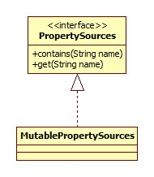
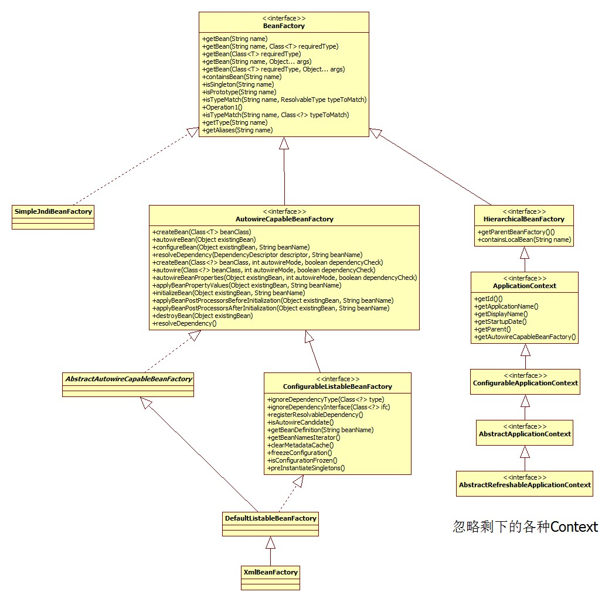
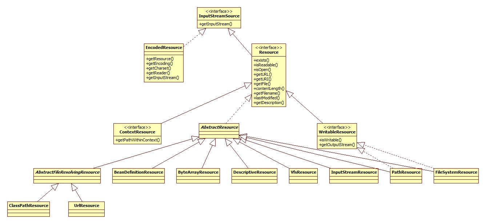
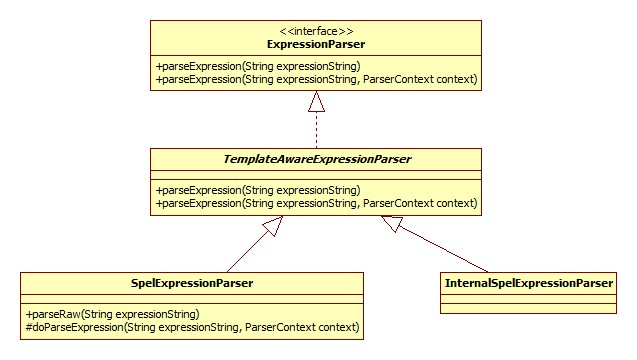

# 基本

本部分从最基本的Spring开始。配置文件:

```xml
<?xml version="1.0" encoding="UTF-8"?>    
<beans>    
  	<bean class="base.SimpleBean"></bean>
</beans>
```

启动代码:

```java
public static void main(String[] args) {
	ClassPathXmlApplicationContext context = new ClassPathXmlApplicationContext("config.xml");
	SimpleBean bean = context.getBean(SimpleBean.class);
	bean.send();
	context.close();
}
```

SimpleBean:

```java
public class SimpleBean {
	public void send() {
		System.out.println("I am send method from SimpleBean!");
	}
}
```

## ClassPathXmlApplicationContext

整个继承体系如下:


ResourceLoader代表了**加载资源的一种方式，正是策略模式的实现**。

构造器源码:

```java
public ClassPathXmlApplicationContext(String[] configLocations, boolean refresh, ApplicationContext 	         parent) {
  	//null
	super(parent);
	setConfigLocations(configLocations);
  	//默认true
	if (refresh) {
		refresh();
	}
}
```

### 构造器

首先看父类构造器，沿着继承体系一直向上调用，直到AbstractApplicationContext:

```java
public AbstractApplicationContext(ApplicationContext parent) {
	this();
	setParent(parent);
}
public AbstractApplicationContext() {
	this.resourcePatternResolver = getResourcePatternResolver();
}
```

getResourcePatternResolver:

```java
protected ResourcePatternResolver getResourcePatternResolver() {
	return new PathMatchingResourcePatternResolver(this);
}
```

PathMatchingResourcePatternResolver支持Ant风格的路径解析。

### 设置配置文件路径

即AbstractRefreshableConfigApplicationContext.setConfigLocations:

```java
public void setConfigLocations(String... locations) {
	if (locations != null) {
		Assert.noNullElements(locations, "Config locations must not be null");
		this.configLocations = new String[locations.length];
		for (int i = 0; i < locations.length; i++) {
			this.configLocations[i] = resolvePath(locations[i]).trim();
		}
	} else {
		this.configLocations = null;
	}
}
```

resolvePath:

```java
protected String resolvePath(String path) {
	return getEnvironment().resolveRequiredPlaceholders(path);
}
```

此方法的目的在于将占位符(placeholder)解析成实际的地址。比如可以这么写: `new ClassPathXmlApplicationContext("classpath:config.xml");`那么classpath:就是需要被解析的。

getEnvironment方法来自于ConfigurableApplicationContext接口，源码很简单，如果为空就调用createEnvironment创建一个。AbstractApplicationContext.createEnvironment:

```java
protected ConfigurableEnvironment createEnvironment() {
	return new StandardEnvironment();
}
```

#### Environment接口

继承体系:


Environmen接口**代表了当前应用所处的环境。**从此接口的方法可以看出，其主要和profile、Property相关。

##### Profile

Spring Profile特性是从3.1开始的，其主要是为了解决这样一种问题: 线上环境和测试环境使用不同的配置或是数据库或是其它。有了Profile便可以在 不同环境之间无缝切换。**Spring容器管理的所有bean都是和一个profile绑定在一起的。**使用了Profile的配置文件示例:

```xml
<beans profile="develop">  
	<context:property-placeholder location="classpath*:jdbc-develop.properties"/>  
</beans>  
<beans profile="production">  
	<context:property-placeholder location="classpath*:jdbc-production.properties"/>  
</beans>  
<beans profile="test">  
	<context:property-placeholder location="classpath*:jdbc-test.properties"/>  
</beans>
```

在启动代码中可以用如下代码设置活跃(当前使用的)Profile:

```java
context.getEnvironment().setActiveProfiles("dev");
```

当然使用的方式还有很多(比如注解)，参考:

[spring3.1 profile 配置不同的环境](http://radiumxie.iteye.com/blog/1851919)

[Spring Profiles example](http://www.mkyong.com/spring/spring-profiles-example/)

##### Property

这里的Property指的是程序运行时的一些参数，引用注释:

> > properties files, JVM system properties, system environment variables, JNDI, servlet context parameters, ad-hoc Properties objects,Maps, and so on.

#### Environment构造器

```java
private final MutablePropertySources propertySources = new MutablePropertySources(this.logger);
public AbstractEnvironment() {
	customizePropertySources(this.propertySources);
}
```

#####  PropertySources接口

继承体系:



此接口实际上是PropertySource的容器，默认的MutablePropertySources实现内部含有一个CopyOnWriteArrayList作为存储载体。

StandardEnvironment.customizePropertySources:

```java
/** System environment property source name: {@value} */
public static final String SYSTEM_ENVIRONMENT_PROPERTY_SOURCE_NAME = "systemEnvironment";
/** JVM system properties property source name: {@value} */
public static final String SYSTEM_PROPERTIES_PROPERTY_SOURCE_NAME = "systemProperties";
@Override
protected void customizePropertySources(MutablePropertySources propertySources) {
	propertySources.addLast(new MapPropertySource
		(SYSTEM_PROPERTIES_PROPERTY_SOURCE_NAME, getSystemProperties()));
	propertySources.addLast(new SystemEnvironmentPropertySource
		(SYSTEM_ENVIRONMENT_PROPERTY_SOURCE_NAME, getSystemEnvironment()));
}
```

##### PropertySource接口

PropertySource接口代表了键值对的Property来源。继承体系：


AbstractEnvironment.getSystemProperties:

```java
@Override
public Map<String, Object> getSystemProperties() {
	try {
		return (Map) System.getProperties();
	}
	catch (AccessControlException ex) {
		return (Map) new ReadOnlySystemAttributesMap() {
			@Override
			protected String getSystemAttribute(String attributeName) {
				try {
					return System.getProperty(attributeName);
				}
				catch (AccessControlException ex) {
					if (logger.isInfoEnabled()) {
						logger.info(format("Caught AccessControlException when accessing system " +
								"property [%s]; its value will be returned [null]. Reason: %s",
								attributeName, ex.getMessage()));
					}
					return null;
				}
			}
		};
	}
}
```

这里的实现很有意思，如果安全管理器阻止获取全部的系统属性，那么会尝试获取单个属性的可能性，如果还不行就抛异常了。

getSystemEnvironment方法也是一个套路，不过最终调用的是System.getenv，可以获取jvm和OS的一些版本信息。

#### 路径Placeholder处理

AbstractEnvironment.resolveRequiredPlaceholders:

```java
@Override
public String resolveRequiredPlaceholders(String text) throws IllegalArgumentException {
  	//text即配置文件路径，比如classpath:config.xml
	return this.propertyResolver.resolveRequiredPlaceholders(text);
}
```

propertyResolver是一个PropertySourcesPropertyResolver对象:

```java
private final ConfigurablePropertyResolver propertyResolver =
			new PropertySourcesPropertyResolver(this.propertySources);
```

##### PropertyResolver接口

PropertyResolver继承体系(排除Environment分支):


此接口正是用来解析PropertyResource。

##### 解析

AbstractPropertyResolver.resolveRequiredPlaceholders:

```java
@Override
public String resolveRequiredPlaceholders(String text) throws IllegalArgumentException {
	if (this.strictHelper == null) {
		this.strictHelper = createPlaceholderHelper(false);
	}
	return doResolvePlaceholders(text, this.strictHelper);
}
```

```java
private PropertyPlaceholderHelper createPlaceholderHelper(boolean ignoreUnresolvablePlaceholders) {
  	//三个参数分别是${, }, :
	return new PropertyPlaceholderHelper(this.placeholderPrefix, this.placeholderSuffix,
		this.valueSeparator, ignoreUnresolvablePlaceholders);
}
```

doResolvePlaceholders：

```java
private String doResolvePlaceholders(String text, PropertyPlaceholderHelper helper) {
  	//PlaceholderResolver接口依然是策略模式的体现
	return helper.replacePlaceholders(text, new PropertyPlaceholderHelper.PlaceholderResolver() {
		@Override
		public String resolvePlaceholder(String placeholderName) {
			return getPropertyAsRawString(placeholderName);
		}
	});
}
```

其实代码执行到这里的时候还没有进行xml配置文件的解析，那么这里的解析placeHolder是什么意思呢，原因在于可以这么写:

```java
System.setProperty("spring", "classpath");
ClassPathXmlApplicationContext context = new ClassPathXmlApplicationContext("${spring}:config.xml");
SimpleBean bean = context.getBean(SimpleBean.class);
```

这样就可以正确解析。placeholder的替换其实就是字符串操作，这里只说一下正确的属性是怎么来的。实现的关键在于PropertySourcesPropertyResolver.getProperty:

```java
@Override
protected String getPropertyAsRawString(String key) {
	return getProperty(key, String.class, false);
}
protected <T> T getProperty(String key, Class<T> targetValueType, boolean resolveNestedPlaceholders) {
	if (this.propertySources != null) {
		for (PropertySource<?> propertySource : this.propertySources) {
			Object value = propertySource.getProperty(key);
			return value;
		}
	}
	return null;
}
```

很明显了，就是从System.getProperty和System.getenv获取，但是由于环境变量是无法自定义的，所以其实此处只能通过System.setProperty指定。

注意，classpath:XXX这种写法的classpath前缀到目前为止还没有被处理。

## refresh

Spring bean解析就在此方法，所以单独提出来。

AbstractApplicationContext.refresh:

```java
@Override
public void refresh() throws BeansException, IllegalStateException {
	synchronized (this.startupShutdownMonitor) {
		// Prepare this context for refreshing.
		prepareRefresh();
		// Tell the subclass to refresh the internal bean factory.
		ConfigurableListableBeanFactory beanFactory = obtainFreshBeanFactory();
		// Prepare the bean factory for use in this context.
		prepareBeanFactory(beanFactory);
		try {
			// Allows post-processing of the bean factory in context subclasses.
			postProcessBeanFactory(beanFactory);
			// Invoke factory processors registered as beans in the context.
			invokeBeanFactoryPostProcessors(beanFactory);
			// Register bean processors that intercept bean creation.
			registerBeanPostProcessors(beanFactory);
			// Initialize message source for this context.
			initMessageSource();
			// Initialize event multicaster for this context.
			initApplicationEventMulticaster();
			// Initialize other special beans in specific context subclasses.
			onRefresh();
			// Check for listener beans and register them.
			registerListeners();
			// Instantiate all remaining (non-lazy-init) singletons.
			finishBeanFactoryInitialization(beanFactory);
			// Last step: publish corresponding event.
			finishRefresh();
		} catch (BeansException ex) {
			// Destroy already created singletons to avoid dangling resources.
			destroyBeans();
			// Reset 'active' flag.
			cancelRefresh(ex);
			// Propagate exception to caller.
			throw ex;
		} finally {
			// Reset common introspection caches in Spring's core, since we
			// might not ever need metadata for singleton beans anymore...
			resetCommonCaches();
		}
	}
}
```

### prepareRefresh

```java
protected void prepareRefresh() {
	this.startupDate = System.currentTimeMillis();
	this.closed.set(false);
	this.active.set(true);
	// Initialize any placeholder property sources in the context environment
  	//空实现
	initPropertySources();
	// Validate that all properties marked as required are resolvable
	// see ConfigurablePropertyResolver#setRequiredProperties
	getEnvironment().validateRequiredProperties();
	// Allow for the collection of early ApplicationEvents,
	// to be published once the multicaster is available...
	this.earlyApplicationEvents = new LinkedHashSet<ApplicationEvent>();
}
```

#### 属性校验

AbstractEnvironment.validateRequiredProperties:

```java
@Override
public void validateRequiredProperties() throws MissingRequiredPropertiesException {
	this.propertyResolver.validateRequiredProperties();
}
```

AbstractPropertyResolver.validateRequiredProperties:

```java
@Override
public void validateRequiredProperties() {
	MissingRequiredPropertiesException ex = new MissingRequiredPropertiesException();
	for (String key : this.requiredProperties) {
		if (this.getProperty(key) == null) {
			ex.addMissingRequiredProperty(key);
		}
	}
	if (!ex.getMissingRequiredProperties().isEmpty()) {
		throw ex;
	}
}
```

requiredProperties是通过setRequiredProperties方法设置的，保存在一个list里面，默认是空的，也就是不需要校验任何属性。

### BeanFactory创建

由obtainFreshBeanFactory调用AbstractRefreshableApplicationContext.refreshBeanFactory:

```java
@Override
protected final void refreshBeanFactory() throws BeansException {
  	//如果已经存在，那么销毁之前的
	if (hasBeanFactory()) {
		destroyBeans();
		closeBeanFactory();
	}
    //创建了一个DefaultListableBeanFactory对象
    DefaultListableBeanFactory beanFactory = createBeanFactory();
    beanFactory.setSerializationId(getId());
    customizeBeanFactory(beanFactory);
    loadBeanDefinitions(beanFactory);
    synchronized (this.beanFactoryMonitor) {
    	this.beanFactory = beanFactory;
    }
}
```

#### BeanFactory接口

此接口实际上就是Bean容器，其继承体系:



#### BeanFactory定制

AbstractRefreshableApplicationContext.customizeBeanFactory方法用于给子类提供一个自由配置的机会，默认实现:

```java
protected void customizeBeanFactory(DefaultListableBeanFactory beanFactory) {
	if (this.allowBeanDefinitionOverriding != null) {
      	//默认false，不允许覆盖
		beanFactory.setAllowBeanDefinitionOverriding(this.allowBeanDefinitionOverriding);
	}
	if (this.allowCircularReferences != null) {
      	//默认false，不允许循环引用
		beanFactory.setAllowCircularReferences(this.allowCircularReferences);
	}
}
```

#### Bean加载

AbstractXmlApplicationContext.loadBeanDefinitions，这个便是核心的bean加载了:

```java
@Override
protected void loadBeanDefinitions(DefaultListableBeanFactory beanFactory) {
	// Create a new XmlBeanDefinitionReader for the given BeanFactory.
	XmlBeanDefinitionReader beanDefinitionReader = new XmlBeanDefinitionReader(beanFactory);
	// Configure the bean definition reader with this context's
	// resource loading environment.
	beanDefinitionReader.setEnvironment(this.getEnvironment());
	beanDefinitionReader.setResourceLoader(this);
	beanDefinitionReader.setEntityResolver(new ResourceEntityResolver(this));
	// Allow a subclass to provide custom initialization of the reader,
	// then proceed with actually loading the bean definitions.
  	//默认空实现
	initBeanDefinitionReader(beanDefinitionReader);
	loadBeanDefinitions(beanDefinitionReader);
}
```

##### EntityResolver

此处只说明用到的部分继承体系:


EntityResolver接口在org.xml.sax中定义。DelegatingEntityResolver用于schema和dtd的解析。

##### BeanDefinitionReader

继承体系:


##### 路径解析(Ant)

```java
protected void loadBeanDefinitions(XmlBeanDefinitionReader reader) {
	Resource[] configResources = getConfigResources();
	if (configResources != null) {
		reader.loadBeanDefinitions(configResources);
	}
	String[] configLocations = getConfigLocations();
  	//here
	if (configLocations != null) {
		reader.loadBeanDefinitions(configLocations);
	}
}
```

AbstractBeanDefinitionReader.loadBeanDefinitions:

```java
@Override
public int loadBeanDefinitions(String... locations) throws BeanDefinitionStoreException {
	Assert.notNull(locations, "Location array must not be null");
	int counter = 0;
	for (String location : locations) {
		counter += loadBeanDefinitions(location);
	}
	return counter;
}
```

之后调用:

```java
//第二个参数为空
public int loadBeanDefinitions(String location, Set<Resource> actualResources) {
	ResourceLoader resourceLoader = getResourceLoader();
  	//参见ResourceLoader类图，ClassPathXmlApplicationContext实现了此接口
	if (resourceLoader instanceof ResourcePatternResolver) {
		// Resource pattern matching available.
		try {
			Resource[] resources = ((ResourcePatternResolver) resourceLoader).getResources(location);
			int loadCount = loadBeanDefinitions(resources);
			if (actualResources != null) {
				for (Resource resource : resources) {
					actualResources.add(resource);
				}
			}
			return loadCount;
		}
		catch (IOException ex) {
			throw new BeanDefinitionStoreException(
					"Could not resolve bean definition resource pattern [" + location + "]", ex);
		}
	}
	else {
		// Can only load single resources by absolute URL.
		Resource resource = resourceLoader.getResource(location);
		int loadCount = loadBeanDefinitions(resource);
		if (actualResources != null) {
			actualResources.add(resource);
		}
		return loadCount;
	}
}
```

getResource的实现在AbstractApplicationContext：

```java
@Override
public Resource[] getResources(String locationPattern) throws IOException {
  	//构造器中初始化，PathMatchingResourcePatternResolver对象
	return this.resourcePatternResolver.getResources(locationPattern);
}
```

PathMatchingResourcePatternResolver是ResourceLoader继承体系的一部分。

```java
@Override
public Resource[] getResources(String locationPattern) throws IOException {
	Assert.notNull(locationPattern, "Location pattern must not be null");
  	//classpath:
	if (locationPattern.startsWith(CLASSPATH_ALL_URL_PREFIX)) {
		// a class path resource (multiple resources for same name possible)
      	//matcher是一个AntPathMatcher对象
		if (getPathMatcher().isPattern(locationPattern
			.substring(CLASSPATH_ALL_URL_PREFIX.length()))) {
			// a class path resource pattern
			return findPathMatchingResources(locationPattern);
		} else {
			// all class path resources with the given name
			return findAllClassPathResources(locationPattern
				.substring(CLASSPATH_ALL_URL_PREFIX.length()));
		}
	} else {
		// Only look for a pattern after a prefix here
		// (to not get fooled by a pattern symbol in a strange prefix).
		int prefixEnd = locationPattern.indexOf(":") + 1;
		if (getPathMatcher().isPattern(locationPattern.substring(prefixEnd))) {
			// a file pattern
			return findPathMatchingResources(locationPattern);
		}
		else {
			// a single resource with the given name
			return new Resource[] {getResourceLoader().getResource(locationPattern)};
		}
	}
}
```

isPattern:

```java
@Override
public boolean isPattern(String path) {
	return (path.indexOf('*') != -1 || path.indexOf('?') != -1);
}
```

可以看出配置文件路径是支持ant风格的，也就是可以这么写:

```java
new ClassPathXmlApplicationContext("con*.xml");
```

具体怎么解析ant风格的就不写了。

##### 配置文件加载

入口方法在AbstractBeanDefinitionReader的217行:

```java
//加载
Resource[] resources = ((ResourcePatternResolver) resourceLoader).getResources(location);
//解析
int loadCount = loadBeanDefinitions(resources);
```

最终逐个调用XmlBeanDefinitionReader的loadBeanDefinitions方法:

```java
@Override
public int loadBeanDefinitions(Resource resource) {
	return loadBeanDefinitions(new EncodedResource(resource));
}
```

Resource是代表一种资源的接口，其类图:



EncodedResource扮演的其实是一个装饰器的模式，为InputStreamSource添加了字符编码(虽然默认为null)。这样为我们自定义xml配置文件的编码方式提供了机会。

之后关键的源码只有两行:

```java
public int loadBeanDefinitions(EncodedResource encodedResource) throws BeanDefinitionStoreException {
	InputStream inputStream = encodedResource.getResource().getInputStream();
  	InputSource inputSource = new InputSource(inputStream);
	return doLoadBeanDefinitions(inputSource, encodedResource.getResource());
}
```

InputSource是org.xml.sax的类。

doLoadBeanDefinitions：

```java
protected int doLoadBeanDefinitions(InputSource inputSource, Resource resource) {
	Document doc = doLoadDocument(inputSource, resource);
	return registerBeanDefinitions(doc, resource);
}
```

doLoadDocument:

```java
protected Document doLoadDocument(InputSource inputSource, Resource resource) {
	return this.documentLoader.loadDocument(inputSource, getEntityResolver(), this.errorHandler,
		getValidationModeForResource(resource), isNamespaceAware());
}
```

documentLoader是一个DefaultDocumentLoader对象，此类是DocumentLoader接口的唯一实现。getEntityResolver方法返回ResourceEntityResolver，上面说过了。errorHandler是一个SimpleSaxErrorHandler对象。

校验模型其实就是确定xml文件使用xsd方式还是dtd方式来校验，忘了的话左转度娘。Spring会通过读取xml文件的方式判断应该采用哪种。

NamespaceAware默认false，因为默认配置了校验为true。

DefaultDocumentLoader.loadDocument:

```java
@Override
public Document loadDocument(InputSource inputSource, EntityResolver entityResolver,
	ErrorHandler errorHandler, int validationMode, boolean namespaceAware) {
  	//这里就是老套路了，可以看出，Spring还是使用了dom的方式解析，即一次全部load到内存
	DocumentBuilderFactory factory = createDocumentBuilderFactory(validationMode, namespaceAware);
	DocumentBuilder builder = createDocumentBuilder(factory, entityResolver, errorHandler);
	return builder.parse(inputSource);
}
```

createDocumentBuilderFactory比较有意思:

```java
protected DocumentBuilderFactory createDocumentBuilderFactory(int validationMode, boolean namespaceAware{
	DocumentBuilderFactory factory = DocumentBuilderFactory.newInstance();
	factory.setNamespaceAware(namespaceAware);
	if (validationMode != XmlValidationModeDetector.VALIDATION_NONE) {
      	//此方法设为true仅对dtd有效，xsd(schema)无效
		factory.setValidating(true);
		if (validationMode == XmlValidationModeDetector.VALIDATION_XSD) {
			// Enforce namespace aware for XSD...
          	 //开启xsd(schema)支持
			factory.setNamespaceAware(true);
          	 //这个也是Java支持Schema的套路，可以问度娘
			factory.setAttribute(SCHEMA_LANGUAGE_ATTRIBUTE, XSD_SCHEMA_LANGUAGE);
		}
	}
	return factory;
}
```

##### Bean解析

XmlBeanDefinitionReader.registerBeanDefinitions:

```java
public int registerBeanDefinitions(Document doc, Resource resource) {
	BeanDefinitionDocumentReader documentReader = createBeanDefinitionDocumentReader();
	int countBefore = getRegistry().getBeanDefinitionCount();
	documentReader.registerBeanDefinitions(doc, createReaderContext(resource));
	return getRegistry().getBeanDefinitionCount() - countBefore;
}
```

createBeanDefinitionDocumentReader:

```java
protected BeanDefinitionDocumentReader createBeanDefinitionDocumentReader() {
	return BeanDefinitionDocumentReader.class.cast
      //反射
      (BeanUtils.instantiateClass(this.documentReaderClass));
}
```

documentReaderClass默认是DefaultBeanDefinitionDocumentReader，这其实也是策略模式，通过setter方法可以更换其实现。

注意cast方法，代替了强转。

createReaderContext：

```java
public XmlReaderContext createReaderContext(Resource resource) {
	return new XmlReaderContext(resource, this.problemReporter, this.eventListener,
		this.sourceExtractor, this, getNamespaceHandlerResolver());
}
```

problemReporter是一个FailFastProblemReporter对象。

eventListener是EmptyReaderEventListener对象，此类里的方法都是空实现。

sourceExtractor是NullSourceExtractor对象，直接返回空，也是空实现。

getNamespaceHandlerResolver默认返回DefaultNamespaceHandlerResolver对象，用来获取xsd对应的处理器。

XmlReaderContext的作用感觉就是这一堆参数的容器，糅合到一起传给DocumentReader，并美其名为Context。可以看出，Spring中到处都是策略模式，大量操作被抽象成接口。

DefaultBeanDefinitionDocumentReader.registerBeanDefinitions:

```java
@Override
public void registerBeanDefinitions(Document doc, XmlReaderContext readerContext) {
	this.readerContext = readerContext;
	Element root = doc.getDocumentElement();
	doRegisterBeanDefinitions(root);
}
```

doRegisterBeanDefinitions:

```java
protected void doRegisterBeanDefinitions(Element root) {
	BeanDefinitionParserDelegate parent = this.delegate;
	this.delegate = createDelegate(getReaderContext(), root, parent);
  	//默认的命名空间即
  	//http://www.springframework.org/schema/beans
	if (this.delegate.isDefaultNamespace(root)) {
      	//检查profile属性
		String profileSpec = root.getAttribute(PROFILE_ATTRIBUTE);
		if (StringUtils.hasText(profileSpec)) {
          	//profile属性可以以,分割
			String[] specifiedProfiles = StringUtils.tokenizeToStringArray(
					profileSpec, BeanDefinitionParserDelegate.MULTI_VALUE_ATTRIBUTE_DELIMITERS);
			if (!getReaderContext().getEnvironment().acceptsProfiles(specifiedProfiles)) {
				return;
			}
		}
	}
	preProcessXml(root);
	parseBeanDefinitions(root, this.delegate);
	postProcessXml(root);
	this.delegate = parent;
}
```

delegate的作用在于处理beans标签的嵌套，其实Spring配置文件是可以写成这样的:

```xml
<?xml version="1.0" encoding="UTF-8"?>    
<beans>    
  	<bean class="base.SimpleBean"></bean>
  	<beans>
  		<bean class="java.lang.Object"></bean>
  	</beans>
</beans>
```

xml(schema)的命名空间其实类似于java的报名，命名空间采用URL，比如Spring的是这样:

```xml
<?xml version="1.0" encoding="UTF-8"?>    
<beans xmlns="http://www.springframework.org/schema/beans"></beans>
```

xmlns属性就是xml规范定义的用来设置命名空间的。这样设置了之后其实里面的bean元素全名就相当于http://www.springframework.org/schema/beans:bean，可以有效的防止命名冲突。命名空间可以通过规范定义的org.w3c.dom.Node.getNamespaceURI方法获得。

注意一下profile的检查, AbstractEnvironment.acceptsProfiles:

```java
@Override
public boolean acceptsProfiles(String... profiles) {
	Assert.notEmpty(profiles, "Must specify at least one profile");
	for (String profile : profiles) {
		if (StringUtils.hasLength(profile) && profile.charAt(0) == '!') {
			if (!isProfileActive(profile.substring(1))) {
				return true;
			}
		} else if (isProfileActive(profile)) {
			return true;
		}
	}
	return false;
}
```

原理很简单，注意从源码可以看出，**profile属性支持!取反**。

preProcessXml方法是个空实现，供子类去覆盖，**目的在于给子类一个把我们自定义的标签转为Spring标准标签的机会**, 想的真周到。

DefaultBeanDefinitionDocumentReader.parseBeanDefinitions：

```java
protected void parseBeanDefinitions(Element root, BeanDefinitionParserDelegate delegate) {
	if (delegate.isDefaultNamespace(root)) {
		NodeList nl = root.getChildNodes();
		for (int i = 0; i < nl.getLength(); i++) {
			Node node = nl.item(i);
			if (node instanceof Element) {
				Element ele = (Element) node;
				if (delegate.isDefaultNamespace(ele)) {
					parseDefaultElement(ele, delegate);
				} else {
					delegate.parseCustomElement(ele);
				}
			}
		}
	} else {
		delegate.parseCustomElement(root);
	}
}
```

可见，对于非默认命名空间的元素交由delegate处理。

#### 默认命名空间解析

即import, alias, bean, 嵌套的beans四种元素。parseDefaultElement:

```java
private void parseDefaultElement(Element ele, BeanDefinitionParserDelegate delegate) {
  	//"import"
	if (delegate.nodeNameEquals(ele, IMPORT_ELEMENT)) {
		importBeanDefinitionResource(ele);
	}
	else if (delegate.nodeNameEquals(ele, ALIAS_ELEMENT)) {
		processAliasRegistration(ele);
	}
	else if (delegate.nodeNameEquals(ele, BEAN_ELEMENT)) {
		processBeanDefinition(ele, delegate);
	}
	else if (delegate.nodeNameEquals(ele, NESTED_BEANS_ELEMENT)) {
		// recurse
		doRegisterBeanDefinitions(ele);
	}
}
```

##### import

写法示例:

```xml
<import resource="CTIContext.xml" />
<import resource="customerContext.xml" />
```

importBeanDefinitionResource套路和之前的配置文件加载完全一样，不过注意被import进来的文件是先于当前文件 被解析的。

##### alias

加入有一个bean名为componentA-dataSource，但是另一个组件想以componentB-dataSource的名字使用，就可以这样定义:

```xml
<alias name="componentA-dataSource" alias="componentB-dataSource"/>
```

processAliasRegistration核心源码:

```java
protected void processAliasRegistration(Element ele) {
	String name = ele.getAttribute(NAME_ATTRIBUTE);
	String alias = ele.getAttribute(ALIAS_ATTRIBUTE);
	getReaderContext().getRegistry().registerAlias(name, alias);
	getReaderContext().fireAliasRegistered(name, alias, extractSource(ele));
}
```

从前面的源码可以发现，registry其实就是DefaultListableBeanFactory，它实现了BeanDefinitionRegistry接口。registerAlias方法的实现在SimpleAliasRegistry:

```java
@Override
public void registerAlias(String name, String alias) {
	Assert.hasText(name, "'name' must not be empty");
	Assert.hasText(alias, "'alias' must not be empty");
  	//名字和别名一样
	if (alias.equals(name)) {
      	//ConcurrentHashMap
		this.aliasMap.remove(alias);
	} else {
		String registeredName = this.aliasMap.get(alias);
		if (registeredName != null) {
			if (registeredName.equals(name)) {
				// An existing alias - no need to re-register
				return;
			}
			if (!allowAliasOverriding()) {
				throw new IllegalStateException
					("Cannot register alias '" + alias + "' for name '" +
					name + "': It is already registered for name '" + registeredName + "'.");
			}
		}
		checkForAliasCircle(name, alias);
		this.aliasMap.put(alias, name);
	}
}
```

所以别名关系的保存使用Map完成，key为别名，value为本来的名字。

##### bean

bean节点是Spring最最常见的节点了。

DefaultBeanDefinitionDocumentReader.processBeanDefinition:

```java
protected void processBeanDefinition(Element ele, BeanDefinitionParserDelegate delegate) {
	BeanDefinitionHolder bdHolder = delegate.parseBeanDefinitionElement(ele);
	if (bdHolder != null) {
		bdHolder = delegate.decorateBeanDefinitionIfRequired(ele, bdHolder);
		try {
			// Register the final decorated instance.
			BeanDefinitionReaderUtils.registerBeanDefinition
				(bdHolder, getReaderContext().getRegistry());
		}
		catch (BeanDefinitionStoreException ex) {
			getReaderContext().error("Failed to register bean definition with name '" +
					bdHolder.getBeanName() + "'", ele, ex);
		}
		// Send registration event.
		getReaderContext().fireComponentRegistered(new BeanComponentDefinition(bdHolder));
	}
}
```

###### id & name处理

最终调用BeanDefinitionParserDelegate.parseBeanDefinitionElement(Element ele, BeanDefinition containingBean)，源码较长，分部分说明。

首先获取到id和name属性，**name属性支持配置多个，以逗号分隔，如果没有指定id，那么将以第一个name属性值代替。id必须是唯一的，name属性其实是alias的角色，可以和其它的bean重复，如果name也没有配置，那么其实什么也没做**。

```java
String id = ele.getAttribute(ID_ATTRIBUTE);
String nameAttr = ele.getAttribute(NAME_ATTRIBUTE);
List<String> aliases = new ArrayList<String>();
if (StringUtils.hasLength(nameAttr)) {
  	//按,分隔
	String[] nameArr = StringUtils.tokenizeToStringArray
		(nameAttr, MULTI_VALUE_ATTRIBUTE_DELIMITERS);
	aliases.addAll(Arrays.asList(nameArr));
}
String beanName = id;
if (!StringUtils.hasText(beanName) && !aliases.isEmpty()) {
  	//name的第一个值作为id
	beanName = aliases.remove(0);
}
//默认null
if (containingBean == null) {
  	//校验id是否已重复，如果重复直接抛异常
  	//校验是通过内部一个HashSet完成的，出现过的id都会保存进此Set
	checkNameUniqueness(beanName, aliases, ele);
}
```

###### beanName生成

如果name和id属性都没有指定，那么Spring会自己生成一个, BeanDefinitionParserDelegate.parseBeanDefinitionElement:

```java
beanName = this.readerContext.generateBeanName(beanDefinition);
String beanClassName = beanDefinition.getBeanClassName();
aliases.add(beanClassName);
```

可见，Spring同时会把类名作为其别名。

最终调用的是BeanDefinitionReaderUtils.generateBeanName:

```java
public static String generateBeanName(
		BeanDefinition definition, BeanDefinitionRegistry registry, boolean isInnerBean) {
	String generatedBeanName = definition.getBeanClassName();
	if (generatedBeanName == null) {
		if (definition.getParentName() != null) {
			generatedBeanName = definition.getParentName() + "$child";
          	 //工厂方法产生的bean
		} else if (definition.getFactoryBeanName() != null) {
			generatedBeanName = definition.getFactoryBeanName() + "$created";
		}
	}
	String id = generatedBeanName;
	if (isInnerBean) {
		// Inner bean: generate identity hashcode suffix.
		id = generatedBeanName + GENERATED_BEAN_NAME_SEPARATOR + 
			ObjectUtils.getIdentityHexString(definition);
	} else {
		// Top-level bean: use plain class name.
		// Increase counter until the id is unique.
		int counter = -1;
      	 //用类名#自增的数字命名
		while (counter == -1 || registry.containsBeanDefinition(id)) {
			counter++;
			id = generatedBeanName + GENERATED_BEAN_NAME_SEPARATOR + counter;
		}
	}
	return id;
}
```

###### bean解析

还是分部分说明(parseBeanDefinitionElement)。

首先获取到bean的class属性和parent属性，配置了parent之后，当前bean会继承父bean的属性。之后根据class和parent创建BeanDefinition对象。

```java
String className = null;
if (ele.hasAttribute(CLASS_ATTRIBUTE)) {
	className = ele.getAttribute(CLASS_ATTRIBUTE).trim();
}
String parent = null;
if (ele.hasAttribute(PARENT_ATTRIBUTE)) {
	parent = ele.getAttribute(PARENT_ATTRIBUTE);
}
AbstractBeanDefinition bd = createBeanDefinition(className, parent);
```

BeanDefinition的创建在BeanDefinitionReaderUtils.createBeanDefinition:

```java
public static AbstractBeanDefinition createBeanDefinition(
		String parentName, String className, ClassLoader classLoader) {
	GenericBeanDefinition bd = new GenericBeanDefinition();
	bd.setParentName(parentName);
	if (className != null) {
		if (classLoader != null) {
			bd.setBeanClass(ClassUtils.forName(className, classLoader));
		}
		else {
			bd.setBeanClassName(className);
		}
	}
	return bd;
}
```

之后是解析bean的其它属性，其实就是读取其配置，调用相应的setter方法保存在BeanDefinition中:

```java
parseBeanDefinitionAttributes(ele, beanName, containingBean, bd);
```

之后解析bean的decription子元素:

```xml
<bean id="b" name="one, two" class="base.SimpleBean">
	<description>SimpleBean</description>
</bean>
```

就仅仅是个描述。

然后是meta子元素的解析，meta元素在xml配置文件里是这样的:

```xml
<bean id="b" name="one, two" class="base.SimpleBean">
	<meta key="name" value="skywalker"/>
</bean>
```

注释上说，这样可以将任意的元数据附到对应的bean definition上。解析过程源码:

```java
public void parseMetaElements(Element ele, BeanMetadataAttributeAccessor attributeAccessor) {
	NodeList nl = ele.getChildNodes();
	for (int i = 0; i < nl.getLength(); i++) {
		Node node = nl.item(i);
		if (isCandidateElement(node) && nodeNameEquals(node, META_ELEMENT)) {
			Element metaElement = (Element) node;
			String key = metaElement.getAttribute(KEY_ATTRIBUTE);
			String value = metaElement.getAttribute(VALUE_ATTRIBUTE);
          	 //就是一个key, value的载体，无他
			BeanMetadataAttribute attribute = new BeanMetadataAttribute(key, value);
          	 //sourceExtractor默认是NullSourceExtractor，返回的是空
			attribute.setSource(extractSource(metaElement));
			attributeAccessor.addMetadataAttribute(attribute);
		}
	}
}
```

AbstractBeanDefinition继承自BeanMetadataAttributeAccessor类，底层使用了一个LinkedHashMap保存metadata。这个metadata具体是做什么暂时还不知道。

lookup-method解析：

此标签的作用在于当一个bean的某个方法被设置为lookup-method后，**每次调用此方法时，都会返回一个新的指定bean的对象**。用法示例:

```xml
<bean id="apple" class="cn.com.willchen.test.di.Apple" scope="prototype"/>
<!--水果盘-->
<bean id="fruitPlate" class="cn.com.willchen.test.di.FruitPlate">
    <lookup-method name="getFruit" bean="apple"/>
</bean>
```

数据保存在Set中，对应的类是MethodOverrides。可以参考:

[Spring - lookup-method方式实现依赖注入](http://www.cnblogs.com/ViviChan/p/4981619.html)

replace-mothod解析:

此标签用于替换bean里面的特定的方法实现，替换者必须实现Spring的MethodReplacer接口，有点像aop的意思。

配置文件示例:

```xml
<bean name="replacer" class="springroad.deomo.chap4.MethodReplace" />  
<bean name="testBean" class="springroad.deomo.chap4.LookupMethodBean">
	<replaced-method name="test" replacer="replacer">
  		<arg-type match="String" />
  	</replaced-method>  
</bean> 
```

arg-type的作用是指定替换方法的参数类型，因为接口的定义参数都是Object的。参考: [SPRING.NET 1.3.2 学习20--方法注入之替换方法注入](http://blog.csdn.net/lee576/article/details/8725548)

解析之后将数据放在ReplaceOverride对象中，里面有一个LinkedList<String>专门用于保存arg-type。

构造参数(constructor-arg)解析:

作用一目了然，使用示例:

```xml
<bean class="base.SimpleBean">
	<constructor-arg>
  		<value type="java.lang.String">Cat</value>
	</constructor-arg>
</bean>
```

type一般不需要指定，除了泛型集合那种。除此之外，constructor-arg还支持name, index, ref等属性，可以具体的指定参数的位置等。构造参数解析后保存在BeanDefinition内部一个ConstructorArgumentValues对象中。如果设置了index属性，那么以Map<Integer, ValueHolder>的形式保存，反之，以List<ValueHolder>的形式保存。

property解析:

非常常用的标签，用以为bean的属性赋值，支持value和ref两种形式，示例:

```xml
<bean class="base.SimpleBean">
	<property name="name" value="skywalker" />
</bean>
```

value和ref属性不能同时出现，如果是ref，那么将其值保存在不可变的RuntimeBeanReference对象中，其实现了BeanReference接口，此接口只有一个getBeanName方法。如果是value，那么将其值保存在TypedStringValue对象中。最终将对象保存在BeanDefinition内部一个MutablePropertyValues对象中(内部以ArrayList实现)。

qualifier解析:

配置示例:

```xml
<bean class="base.Student">
	<property name="name" value="skywalker"></property>
	<property name="age" value="12"></property>
  	<qualifier type="org.springframework.beans.factory.annotation.Qualifier" value="student" />
</bean>	
<bean class="base.Student">
	<property name="name" value="seaswalker"></property>
	<property name="age" value="15"></property>
	<qualifier value="student_2"></qualifier>
</bean>
<bean class="base.SimpleBean" />
```

SimpleBean部分源码:

```java
@Autowired
@Qualifier("student")
private Student student;
```

此标签和@Qualifier, @Autowired两个注解一起使用才有作用。@Autowired注解采用按类型查找的方式进行注入，如果找到多个需要类型的bean便会报错，有了@Qualifier标签就可以再按照此注解指定的名称查找。两者结合相当于实现了按类型+名称注入。type属性可以不指定，因为默认就是那个。qualifier标签可以有attribute子元素，比如:

```xml
<qualifier type="org.springframework.beans.factory.annotation.Qualifier" value="student">
	<attribute key="id" value="1"/>
</qualifier>
```

貌似是用来在qualifier也区分不开的时候使用。attribute键值对保存在BeanMetadataAttribute对象中。整个qualifier保存在AutowireCandidateQualifier对象中。

###### Bean装饰

这部分是针对其它schema的属性以及子节点，比如:

```xml
<bean class="base.Student" primary="true">
	<context:property-override />
</bean>
```

没见过这种用法，留个坑。

###### Bean注册

BeanDefinitionReaderUtils.registerBeanDefinition:

```java
public static void registerBeanDefinition(
	BeanDefinitionHolder definitionHolder, BeanDefinitionRegistry registry) {
	// Register bean definition under primary name.
	String beanName = definitionHolder.getBeanName();
	registry.registerBeanDefinition(beanName, definitionHolder.getBeanDefinition());
	// Register aliases for bean name, if any.
	String[] aliases = definitionHolder.getAliases();
	if (aliases != null) {
		for (String alias : aliases) {
			registry.registerAlias(beanName, alias);
		}
	}
}
```

registry其实就是DefaultListableBeanFactory对象，registerBeanDefinition方法主要就干了这么两件事:

```java
@Override
public void registerBeanDefinition(String beanName, BeanDefinition beanDefinition) {
	this.beanDefinitionMap.put(beanName, beanDefinition);
	this.beanDefinitionNames.add(beanName);
}
```

一个是Map，另一个是List，一目了然。registerAlias方法的实现在其父类SimpleAliasRegistry，就是把键值对放在了一个ConcurrentHashMap里。

ComponentRegistered事件触发:

默认是个空实现，前面说过了。

###### BeanDefiniton数据结构

BeanDefiniton数据结构如下图:


##### beans

beans元素的嵌套直接递归调用DefaultBeanDefinitionDocumentReader.parseBeanDefinitions。

#### 其它命名空间解析

入口在DefaultBeanDefinitionDocumentReader.parseBeanDefinitions->BeanDefinitionParserDelegate.parseCustomElement(第二个参数为空):

```java
public BeanDefinition parseCustomElement(Element ele, BeanDefinition containingBd) {
	String namespaceUri = getNamespaceURI(ele);
	NamespaceHandler handler = this.readerContext.getNamespaceHandlerResolver().resolve(namespaceUri);
	return handler.parse(ele, new ParserContext(this.readerContext, this, containingBd));
}
```

NamespaceHandlerResolver由XmlBeanDefinitionReader初始化，是一个DefaultNamespaceHandlerResolver对象，也是NamespaceHandlerResolver接口的唯一实现。

其resolve方法:

```java
@Override
public NamespaceHandler resolve(String namespaceUri) {
	Map<String, Object> handlerMappings = getHandlerMappings();
	Object handlerOrClassName = handlerMappings.get(namespaceUri);
	if (handlerOrClassName == null) {
		return null;
	} else if (handlerOrClassName instanceof NamespaceHandler) {
		return (NamespaceHandler) handlerOrClassName;
	} else {
		String className = (String) handlerOrClassName;
		Class<?> handlerClass = ClassUtils.forName(className, this.classLoader);
		NamespaceHandler namespaceHandler = (NamespaceHandler) BeanUtils.instantiateClass(handlerClass);
		namespaceHandler.init();
		handlerMappings.put(namespaceUri, namespaceHandler);
		return namespaceHandler;
	}
}
```

容易看出，Spring其实使用了一个Map了保存其映射关系，key就是命名空间的uri，value是**NamespaceHandler对象或是Class完整名，如果发现是类名，那么用反射的方法进行初始化，如果是NamespaceHandler对象，那么直接返回**。

NamespaceHandler映射关系来自于各个Spring jar包下的META-INF/spring.handlers文件，以spring-context包为例:

```html
http\://www.springframework.org/schema/context=org.springframework.context.config.ContextNamespaceHandler
http\://www.springframework.org/schema/jee=org.springframework.ejb.config.JeeNamespaceHandler
http\://www.springframework.org/schema/lang=org.springframework.scripting.config.LangNamespaceHandler
http\://www.springframework.org/schema/task=org.springframework.scheduling.config.TaskNamespaceHandler
http\://www.springframework.org/schema/cache=org.springframework.cache.config.CacheNamespaceHandler
```

##### NamespaceHandler继承体系


##### init

resolve中调用了其init方法，此方法用以向NamespaceHandler对象注册BeanDefinitionParser对象。**此接口用以解析顶层(beans下)的非默认命名空间元素，比如`<context:annotation-config />`**。

所以这样逻辑就很容易理解了: **每种子标签的解析仍是策略模式的体现，init负责向父类NamespaceHandlerSupport注册不同的策略，由父类的NamespaceHandlerSupport.parse方法根据具体的子标签调用相应的策略完成解析的过程**。

此部分较为重要，所以重新开始大纲。 

##### BeanFactory数据结构

BeanDefinition在BeanFactory中的主要数据结构如下图:


### prepareBeanFactory

此方法负责对BeanFactory进行一些特征的设置工作，"特征"包含这么几个方面:

#### BeanExpressionResolver

此接口只有一个实现: StandardBeanExpressionResolver。接口只含有一个方法:

```java
Object evaluate(String value, BeanExpressionContext evalContext)
```

prepareBeanFactory将一个此对象放入BeanFactory:

```java
beanFactory.setBeanExpressionResolver(new 						 			StandardBeanExpressionResolver(beanFactory.getBeanClassLoader()));
```

StandardBeanExpressionResolver对象内部有一个关键的成员: SpelExpressionParser,其整个类图:



这便是Spring3.0开始出现的Spel表达式的解释器。

#### PropertyEditorRegistrar

此接口用于向Spring注册java.beans.PropertyEditor，只有一个方法:

```java
registerCustomEditors(PropertyEditorRegistry registry)
```

实现也只有一个: ResourceEditorRegistrar。

在编写xml配置时，我们设置的值都是字符串形式，所以在使用时肯定需要转为我们需要的类型，PropertyEditor接口正是定义了这么个东西。

prepareBeanFactory:

```java
beanFactory.addPropertyEditorRegistrar(new ResourceEditorRegistrar(this, getEnvironment()));
```

BeanFactory也暴露了registerCustomEditors方法用以添加自定义的转换器，所以这个地方是组合模式的体现。

我们有两种方式可以添加自定义PropertyEditor:

- 通过`context.getBeanFactory().registerCustomEditor`

- 通过Spring配置文件:

  ```xml
  <bean class="org.springframework.beans.factory.config.CustomEditorConfigurer">
  	<property name="customEditors">
    		<map>
    			<entry key="base.Cat" value="base.CatEditor" /> 
  		</map>
  	</property>
  </bean>
  ```

参考: [深入理解JavaBean(2)：属性编辑器PropertyEditor](http://blog.csdn.net/zhoudaxia/article/details/36247883)

#### 环境注入

在Spring中我们自己的bean可以通过实现EnvironmentAware等一系列Aware接口获取到Spring内部的一些对象。prepareBeanFactory:

```java
beanFactory.addBeanPostProcessor(new ApplicationContextAwareProcessor(this));
```

ApplicationContextAwareProcessor核心的invokeAwareInterfaces方法:

```java
private void invokeAwareInterfaces(Object bean) {
	if (bean instanceof Aware) {
		if (bean instanceof EnvironmentAware) {
			((EnvironmentAware) bean).setEnvironment(this.applicationContext.getEnvironment());
		}
    	if (bean instanceof EmbeddedValueResolverAware) {
			((EmbeddedValueResolverAware) bean).setEmbeddedValueResolver(this.embeddedValueResolver);
		}
      	//....
	}
}
```

#### 依赖解析忽略

此部分设置哪些接口在进行依赖注入的时候应该被忽略:

```java
beanFactory.ignoreDependencyInterface(ResourceLoaderAware.class);
beanFactory.ignoreDependencyInterface(ApplicationEventPublisherAware.class);
beanFactory.ignoreDependencyInterface(MessageSourceAware.class);
beanFactory.ignoreDependencyInterface(ApplicationContextAware.class);
beanFactory.ignoreDependencyInterface(EnvironmentAware.class);
```

#### bean伪装

有些对象并不在BeanFactory中，但是我们依然想让它们可以被装配，这就需要伪装一下:

```java
beanFactory.registerResolvableDependency(BeanFactory.class, beanFactory);
beanFactory.registerResolvableDependency(ResourceLoader.class, this);
beanFactory.registerResolvableDependency(ApplicationEventPublisher.class, this);
beanFactory.registerResolvableDependency(ApplicationContext.class, this);
```

伪装关系保存在一个Map<Class<?>, Object>里。

#### LoadTimeWeaver

如果配置了此bean，那么：

```java
if (beanFactory.containsBean(LOAD_TIME_WEAVER_BEAN_NAME)) {
	beanFactory.addBeanPostProcessor(new LoadTimeWeaverAwareProcessor(beanFactory));
	// Set a temporary ClassLoader for type matching.
	beanFactory.setTempClassLoader(new ContextTypeMatchClassLoader(beanFactory.getBeanClassLoader()));
}
```

这个东西具体是干什么的在后面context:load-time-weaver中说明。

#### 注册环境

源码:

```java
if (!beanFactory.containsLocalBean(ENVIRONMENT_BEAN_NAME)) {
	beanFactory.registerSingleton(ENVIRONMENT_BEAN_NAME, getEnvironment());
}
if (!beanFactory.containsLocalBean(SYSTEM_PROPERTIES_BEAN_NAME)) {
	beanFactory.registerSingleton(SYSTEM_PROPERTIES_BEAN_NAME, getEnvironment().getSystemProperties());
}
if (!beanFactory.containsLocalBean(SYSTEM_ENVIRONMENT_BEAN_NAME)) {
	beanFactory.registerSingleton(SYSTEM_ENVIRONMENT_BEAN_NAME, getEnvironment().
		getSystemEnvironment());
}
```

containsLocalBean特殊之处在于不会去父BeanFactory寻找。

### postProcessBeanFactory

此方法允许子类在所有的bean尚未初始化之前注册BeanPostProcessor。空实现且没有子类覆盖。

### invokeBeanFactoryPostProcessors

BeanFactoryPostProcessor接口允许我们在bean正是初始化之前改变其值。此接口只有一个方法:

```java
void postProcessBeanFactory(ConfigurableListableBeanFactory beanFactory);
```

有两种方式可以向Spring添加此对象:

- 通过代码的方式:

  ```java
  context.addBeanFactoryPostProcessor
  ```

- 通过xml配置的方式:

  ```xml
  <bean class="base.SimpleBeanFactoryPostProcessor" />
  ```

注意此时尚未进行bean的初始化工作，初始化是在后面的finishBeanFactoryInitialization进行的，所以在BeanFactoryPostProcessor对象中获取bean会导致提前初始化。

此方法的关键源码:

```java
protected void invokeBeanFactoryPostProcessors(ConfigurableListableBeanFactory beanFactory) {
	PostProcessorRegistrationDelegate.invokeBeanFactoryPostProcessors(beanFactory,
		getBeanFactoryPostProcessors());
}
```

getBeanFactoryPostProcessors获取的就是AbstractApplicationContext的成员beanFactoryPostProcessors(ArrayList)，但是很有意思，**只有通过context.addBeanFactoryPostProcessor这种方式添加的才会出现在这个List里，所以对于xml配置方式，此List其实没有任何元素。玄机就在PostProcessorRegistrationDelegate里**。

核心思想就是使用BeanFactory的getBeanNamesForType方法获取相应的BeanDefinition的name数组，之后逐一调用getBean方法获取到bean(初始化)，getBean方法后面再说。

注意此处有一个优先级的概念，如果你的BeanFactoryPostProcessor同时实现了Ordered或者是PriorityOrdered接口，那么会被首先执行。

### BeanPostProcessor注册


# spring-context

入口方法在BeanDefinitionParserDelegate.parseCustomElement：

```java
return handler.parse(ele, new ParserContext(this.readerContext, this, containingBd));
```

## annotation-config

AnnotationConfigBeanDefinitionParser.parse:

```java
@Override
public BeanDefinition parse(Element element, ParserContext parserContext) {
	Object source = parserContext.extractSource(element);
	// Obtain bean definitions for all relevant BeanPostProcessors.
	Set<BeanDefinitionHolder> processorDefinitions =
			AnnotationConfigUtils.
				registerAnnotationConfigProcessors(parserContext.getRegistry(), source);
	// Register component for the surrounding <context:annotation-config> element.
	CompositeComponentDefinition compDefinition = 
		new CompositeComponentDefinition(element.getTagName(), source);
	parserContext.pushContainingComponent(compDefinition);
	// Nest the concrete beans in the surrounding component.
	for (BeanDefinitionHolder processorDefinition : processorDefinitions) {
		parserContext.registerComponent(new BeanComponentDefinition(processorDefinition));
	}
	// Finally register the composite component.
	parserContext.popAndRegisterContainingComponent();
	return null;
}
```


