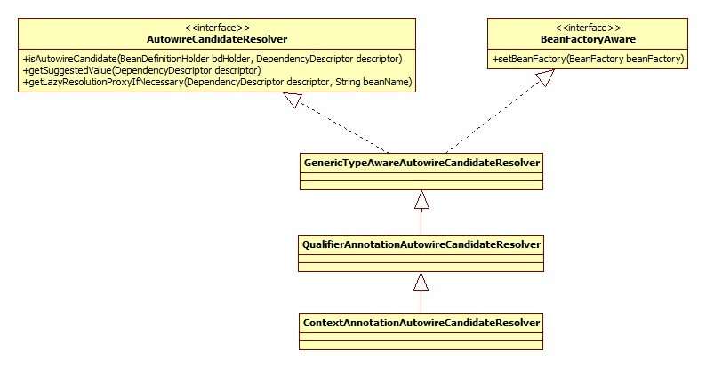
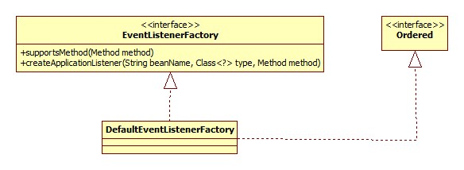

# ****开头

入口方法在BeanDefinitionParserDelegate.parseCustomElement：

```java
return handler.parse(ele, new ParserContext(this.readerContext, this, containingBd));
```

parse方法由各种NamespaceHandler的父类NamespaceHandlerSupport实现:

```java
@Override
public BeanDefinition parse(Element element, ParserContext parserContext) {
	return findParserForElement(element, parserContext).parse(element, parserContext);
}
```

findParserForElement方法用以寻找适用于此元素的BeanDefinitionParser对象:

```java
private BeanDefinitionParser findParserForElement(Element element, ParserContext parserContext) {
	String localName = parserContext.getDelegate().getLocalName(element);
	BeanDefinitionParser parser = this.parsers.get(localName);
	if (parser == null) {
		parserContext.getReaderContext().fatal(
			"Cannot locate BeanDefinitionParser for element [" + localName + "]", element);
	}
	return parser;
}
```

localName是个什么东西呢，比如对于context:annotation-config标签就是annotation-config。

# annotation-config

AnnotationConfigBeanDefinitionParser.parse:

```java
@Override
public BeanDefinition parse(Element element, ParserContext parserContext) {
  	//返回null
	Object source = parserContext.extractSource(element);
	// Obtain bean definitions for all relevant BeanPostProcessors.
	Set<BeanDefinitionHolder> processorDefinitions =
			AnnotationConfigUtils.
				registerAnnotationConfigProcessors(parserContext.getRegistry(), source);
	// Register component for the surrounding <context:annotation-config> element.
	CompositeComponentDefinition compDefinition = 
		new CompositeComponentDefinition(element.getTagName(), source);
	parserContext.pushContainingComponent(compDefinition);
	// Nest the concrete beans in the surrounding component.
	for (BeanDefinitionHolder processorDefinition : processorDefinitions) {
		parserContext.registerComponent(new BeanComponentDefinition(processorDefinition));
	}
	// Finally register the composite component.
  	// 空实现
	parserContext.popAndRegisterContainingComponent();
	return null;
}
```
## BeanPostProcessor注册

AnnotationConfigUtils.registerAnnotationConfigProcessors源码:

```java
//第一个参数其实就是DefaultListableBeanFactory,第二个参数为null
public static Set<BeanDefinitionHolder> registerAnnotationConfigProcessors(
		BeanDefinitionRegistry registry, Object source) {
	//将registery强转为DefaultListableBeanFactory类型
	DefaultListableBeanFactory beanFactory = unwrapDefaultListableBeanFactory(registry);
	if (beanFactory != null) {
		if (!(beanFactory.getDependencyComparator() instanceof AnnotationAwareOrderComparator)) {
			beanFactory.setDependencyComparator(AnnotationAwareOrderComparator.INSTANCE);
		}
		if (!(beanFactory.getAutowireCandidateResolver() instanceof 
			ContextAnnotationAutowireCandidateResolver)) {
			beanFactory.setAutowireCandidateResolver(new ContextAnnotationAutowireCandidateResolver());
		}
	}

	Set<BeanDefinitionHolder> beanDefs = new LinkedHashSet<BeanDefinitionHolder>(4);

	if (!registry.containsBeanDefinition(CONFIGURATION_ANNOTATION_PROCESSOR_BEAN_NAME)) {
		RootBeanDefinition def = new RootBeanDefinition(ConfigurationClassPostProcessor.class);
		def.setSource(source);
		beanDefs.add(registerPostProcessor(registry, def,CONFIGURATION_ANNOTATION_PROCESSOR_BEAN_NAME));
	}

	if (!registry.containsBeanDefinition(AUTOWIRED_ANNOTATION_PROCESSOR_BEAN_NAME)) {
		RootBeanDefinition def = new RootBeanDefinition(AutowiredAnnotationBeanPostProcessor.class);
		def.setSource(source);
		beanDefs.add(registerPostProcessor(registry, def, AUTOWIRED_ANNOTATION_PROCESSOR_BEAN_NAME));
	}

	if (!registry.containsBeanDefinition(REQUIRED_ANNOTATION_PROCESSOR_BEAN_NAME)) {
		RootBeanDefinition def = new RootBeanDefinition(RequiredAnnotationBeanPostProcessor.class);
		def.setSource(source);
		beanDefs.add(registerPostProcessor(registry, def, REQUIRED_ANNOTATION_PROCESSOR_BEAN_NAME));
	}

	// Check for JSR-250 support, and if present add the CommonAnnotationBeanPostProcessor.
	if (jsr250Present && !registry.containsBeanDefinition(COMMON_ANNOTATION_PROCESSOR_BEAN_NAME)) {
		RootBeanDefinition def = new RootBeanDefinition(CommonAnnotationBeanPostProcessor.class);
		def.setSource(source);
		beanDefs.add(registerPostProcessor(registry, def, COMMON_ANNOTATION_PROCESSOR_BEAN_NAME));
	}

	// Check for JPA support, and if present add the PersistenceAnnotationBeanPostProcessor.
	if (jpaPresent && !registry.containsBeanDefinition(PERSISTENCE_ANNOTATION_PROCESSOR_BEAN_NAME)) {
		RootBeanDefinition def = new RootBeanDefinition();
		def.setBeanClass(ClassUtils.forName(PERSISTENCE_ANNOTATION_PROCESSOR_CLASS_NAME,
				AnnotationConfigUtils.class.getClassLoader()));
		def.setSource(source);
		beanDefs.add(registerPostProcessor(registry, def, PERSISTENCE_ANNOTATION_PROCESSOR_BEAN_NAME));
	}

	if (!registry.containsBeanDefinition(EVENT_LISTENER_PROCESSOR_BEAN_NAME)) {
		RootBeanDefinition def = new RootBeanDefinition(EventListenerMethodProcessor.class);
		def.setSource(source);
		beanDefs.add(registerPostProcessor(registry, def, EVENT_LISTENER_PROCESSOR_BEAN_NAME));
	}
	if (!registry.containsBeanDefinition(EVENT_LISTENER_FACTORY_BEAN_NAME)) {
		RootBeanDefinition def = new RootBeanDefinition(DefaultEventListenerFactory.class);
		def.setSource(source);
		beanDefs.add(registerPostProcessor(registry, def, EVENT_LISTENER_FACTORY_BEAN_NAME));
	}

	return beanDefs;
}
```

### AnnotationAwareOrderComparator

其继承体系如下:


其作用是比较标注了@Order或是javax.annotation.Priority @Priority注解的元素的优先级。这两种注解的一个常用功能就是设置配置加载的优先级。例子可以参考:

[Spring 4.2新特性-使用@Order调整配置类加载顺序](http://www.tuicool.com/articles/VnqUv2)

### ContextAnnotationAutowireCandidateResolver

此类用以决定一个bean是否可以当作一个依赖的候选者。其类图:



### ConfigurationClassPostProcessor

此类用于处理标注了@Configuration注解的类。类图:


### AutowiredAnnotationBeanPostProcessor

此类便用于对标注了@Autowire等注解的bean或是方法进行注入。


### RequiredAnnotationBeanPostProcessor

对应Spring @Require注解，此注解被用在setter方法上，意味着此setter方法对应的属性必须被Spring所注入，但是不会检查是否是null。其继承体系和上面的AutowiredAnnotationBeanPostProcessor完全一样。

### CommonAnnotationBeanPostProcessor

用于开启对JSR-250的支持，开启的先决条件是当前classpath中有其类，检测的源码:

```java
private static final boolean jsr250Present =
	ClassUtils.isPresent("javax.annotation.Resource", AnnotationConfigUtils.class.getClassLoader());
```

此注解就在rt.jar下，所以默认情况下都是开启JSR-250支持的，所以我们就可以使用喜闻乐见的@Resource注解了。其类图:


### PersistenceAnnotationBeanPostProcessor

用于提供JPA支持，开启的先决条件仍然是检测classpath下是否有其类存在，源码:

```java
private static final boolean jpaPresent =	
	ClassUtils.isPresent("javax.persistence.EntityManagerFactory", 
		AnnotationConfigUtils.class.getClassLoader()) &&
  	//org.springframework.orm包
	ClassUtils.isPresent(PERSISTENCE_ANNOTATION_PROCESSOR_CLASS_NAME, 
		AnnotationConfigUtils.class.getClassLoader());
```

rt.jar下面并没有JPA的包，所以此Processor默认是没有被注册的。其类图和上面CommonAnnotationBeanPostProcessor如出一辙。

### EventListenerMethodProcessor

提供对于注解@EventListener的支持，此注解在Spring4.2被添加，用于监听ApplicationEvent事件。其继承体系:


### DefaultEventListenerFactory

此类应该是和上面的配合使用，用以产生EventListener对象，也是从Spring4.2加入，类图:



## 逻辑关系整理

普通的bean元素(XML)其实都有一个BeanDefinition对象与之对应，但是对于context开头的这种的特殊的元素，它所对应的一般不再是普通意义上的BeanDefinition，而是配合起来一起完成某种功能的组件(比如各种BeanPostProcessor)。这种组件Spring抽象成为ComponentDefinition接口，组件的集合表示成为CompositeComponentDefinition，类图:


最终形成的数据结构如下图:


不过这个数据结构貌似也没什么用，因为调用的是XmlBeanDefinitionReader中的eventListener的componentRegistered方法，然而这里的eventListener是EmptyReaderEventListener，也就是空实现。

## 运行

### ConfigurationClassPostProcessor

本身是一个BeanFactoryPostProcessor对象，其执行入口在AbstractApplicationContext.refresh方法:

```java
invokeBeanFactoryPostProcessors(beanFactory);
```

注意，因为ConfigurationClassPostProcessor实现自BeanDefinitionRegistryPostProcessor接口，所以在此处会首先调用其postProcessBeanDefinitionRegistry方法，再调用其postProcessBeanFactory方法。

#### postProcessBeanDefinitionRegistry

此方法大体由两部分组成。

##### BeanPostProcessor注册

此部分源码:

```java
@Override
public void postProcessBeanDefinitionRegistry(BeanDefinitionRegistry registry) {
	RootBeanDefinition iabpp = new RootBeanDefinition(ImportAwareBeanPostProcessor.class);
	iabpp.setRole(BeanDefinition.ROLE_INFRASTRUCTURE);
	registry.registerBeanDefinition(IMPORT_AWARE_PROCESSOR_BEAN_NAME, iabpp);
	RootBeanDefinition ecbpp = new RootBeanDefinition(EnhancedConfigurationBeanPostProcessor.class);
	ecbpp.setRole(BeanDefinition.ROLE_INFRASTRUCTURE);
	registry.registerBeanDefinition(ENHANCED_CONFIGURATION_PROCESSOR_BEAN_NAME, ecbpp);
}
```

###### ImportAwareBeanPostProcessor

是ConfigurationClassPostProcessor的私有内部类。其类图:


此类用于处理实现了ImportAware接口的类。ImportAware接口是做什么的要从使用java源文件作为Spring配置说起:

有一个类负责生成Student bean:

```java
@Configuration
public class StudentConfig implements ImportAware {
    @Bean
    public Student student() {
        Student student = new Student();
        student.setAge(22);
        student.setName("skywalker");
        return student;
    }
    @Override
    public void setImportMetadata(AnnotationMetadata importMetadata) {
        System.out.println("importaware");
    }
}
```

生成的bean就以所在的方法名命名。还有一个类负责生成SimpleBean:

```java
@Configuration
@Import(StudentConfig.class)
public class SimpleBeanConfig {
    @Autowired
    private StudentConfig studentConfig;
    @Bean
    public SimpleBean getSimpleBean() {
      	//bean依赖
        SimpleBean simpleBean = new SimpleBean(studentConfig.student());
        return simpleBean;
    }
}
```

启动代码:

```java
public static void main(String[] args) {
	AnnotationConfigApplicationContext context = 
		new AnnotationConfigApplicationContext(SimpleBeanConfig.class);
	SimpleBean simpleBean = context.getBean(SimpleBean.class);
	System.out.println(simpleBean.getStudent().getName());
}
```

所以ImportAware接口的作用就是**使被引用的配置类可以获得引用类的相关信息**。

###### EnhancedConfigurationBeanPostProcessor

用于为实现了EnhancedConfiguration接口的类设置BeanFactory对象，所有的@Configuration Cglib子类均实现了此接口，为什么要这么做不太明白。