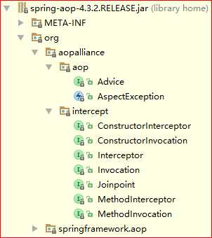
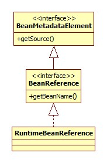
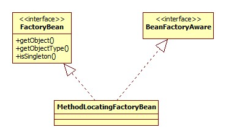
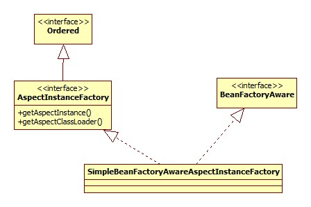
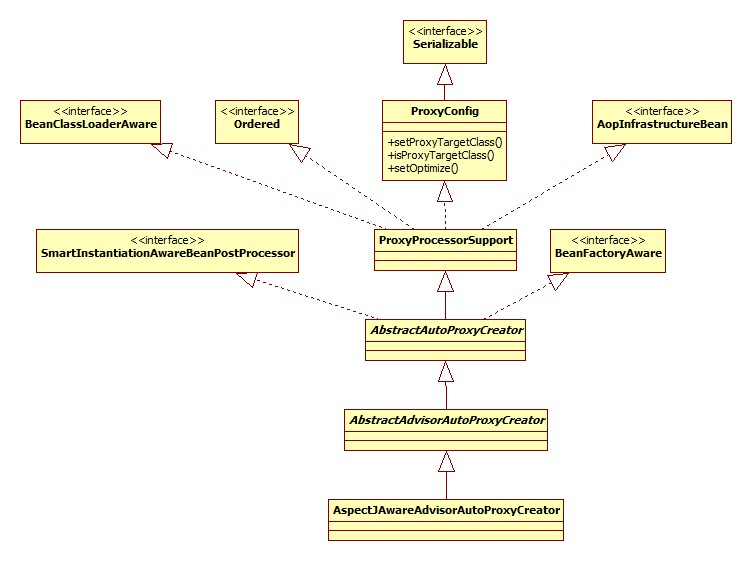
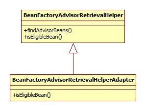
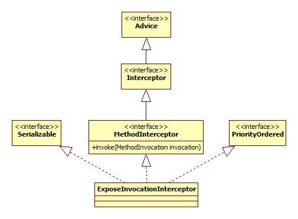
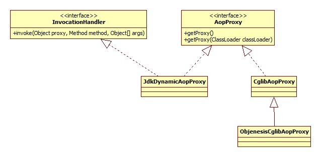

# 开头

aop部分的解析器由AopNamespaceHandler注册，其init方法:

```java
@Override
public void init() {
	registerBeanDefinitionParser("config", new ConfigBeanDefinitionParser());
	registerBeanDefinitionParser("aspectj-autoproxy", new AspectJAutoProxyBeanDefinitionParser());
	registerBeanDefinitionDecorator("scoped-proxy", new ScopedProxyBeanDefinitionDecorator());
}
```

# aop:config

此标签用以配置pointcut, advisor, aspect，实例:

```xml
<aop:config>
	<aop:pointcut expression="execution(* exam.service..*.*(..))" id="transaction"/>
	<aop:advisor advice-ref="txAdvice" pointcut-ref="transaction"/>
  	<aop:aspect ref="" />
</aop:config>
```

ConfigBeanDefinitionParser.parse:

```java
@Override
public BeanDefinition parse(Element element, ParserContext parserContext) {
	CompositeComponentDefinition compositeDef =
			new CompositeComponentDefinition(element.getTagName(), 
			parserContext.extractSource(element));
	parserContext.pushContainingComponent(compositeDef);
  	// 是否生成代理类
	configureAutoProxyCreator(parserContext, element);
	List<Element> childElts = DomUtils.getChildElements(element);
	for (Element elt: childElts) {
		String localName = parserContext.getDelegate().getLocalName(elt);
		if (POINTCUT.equals(localName)) {
			parsePointcut(elt, parserContext);
		} else if (ADVISOR.equals(localName)) {
			parseAdvisor(elt, parserContext);
		} else if (ASPECT.equals(localName)) {
			parseAspect(elt, parserContext);
		}
	}
	parserContext.popAndRegisterContainingComponent();
	return null;
}
```

## 解析

解析的过程主要分为以下几个部分。

### proxy-target-class & expose-proxy

对应着aop:config的两个属性，前者代表是否为被代理这生成CGLIB子类，默认false，只为接口生成代理子类(话说如果不生成子类那么怎么拦截?)。后者代表是否将代理bean暴露给用户，如果暴露，可以通过Spring AopContext类获得，默认不暴露。

解析的过程无非就是属性的读取，不再详细说明。

### aop:pointcut

pointcut的解析是一个生成一个BeanDefinition并将其id, expression等属性保存在BeanDefinition中。注意以下几点:

- BeanDefinition的ID来自于id属性，如果没有，那么自动生成。
- BeanDefinition的class是AspectJExpressionPointcut。
- BeanDefinition的scope为prototype。

AspectJExpressionPointcut类图:


### aop:advisor

首先是其所有属性的示例:

```xml
<aop:advisor id="" order="" advice-ref="aopAdvice" pointcut="" pointcut-ref="" />
```

advisor概念是Spring独有的，来自于上古时代，应该是较早时候的aop概念的实现: [AOP Alliance (Java/J2EE AOP standards)](http://aopalliance.sourceforge.net/)。Spring官方的说法: [aop-schema-advisors](http://docs.spring.io/spring/docs/current/spring-framework-reference/html/aop.html#aop-schema-advisors)。

其相关的包/类就在spring-aop下:



advice-ref是必须的属性，**并且这里的advice必须实现org.aopalliance.aop.Advice的子接口**。这些子接口指的什么呢，见Spring官方文档: [aop-api-advice-types](http://docs.spring.io/spring/docs/current/spring-framework-reference/html/aop-api.html#aop-api-advice-types)。比如org.aopalliance.intercept.MethodInterceptor。

最常见的用途就是结合事务使用:

```xml
<tx:advice id="txAdvice" transaction-manager="transactionManager">
	<tx:attributes>
		<tx:method name="get*" read-only="true" propagation="NOT_SUPPORTED"/>
		<tx:method name="find*" read-only="true" propagation="NOT_SUPPORTED"/>
		<tx:method name="*" propagation="REQUIRED"/>
	</tx:attributes>
</tx:advice>

<aop:config>
	<aop:pointcut expression="execution(* exam.service..*.*(..))" id="transaction"/>
	<aop:advisor advice-ref="txAdvice" pointcut-ref="transaction"/>
</aop:config>
```

解析的套路和楼上类似，只不过此处的beanClass是DefaultBeanFactoryPointcutAdvisor，其类图:


另外注意对于pointcut和pointcut-ref两者处理的区别，对于pointcut属性，Spring会同样创建一个AspectJExpressionPointcut类型的BeanDefinition，对于pointcut-ref会生成一个RuntimeBeanReference对象指向原pointcut的引用。此类的类图:



可以看出，这种aop的实现需要实现各种接口，所以不应该再使用此种方式进行aop，除了Spring内部的实现。

### aop:aspect

配置举例:

```xml
<bean id="aopAdvice" class="base.aop.AopDemoAdvice" />
<!-- 必须配置，因为被代理的对象必须在Spring容器中 -->
<bean id="aopDemo" class="base.aop.AopDemo" />
<aop:config>
	<aop:pointcut id="pointcut" expression="execution(* base.aop.AopDemo.send())" />
	<aop:aspect ref="aopAdvice">
		<aop:before method="beforeSend" pointcut-ref="pointcut" />
		<aop:after method="afterSend" pointcut-ref="pointcut" />
	</aop:aspect>
</aop:config>
```

解析形成的BeanDefinition结构如下:

```html
AspectComponentDefinition
	beanRefArray
		RuntimeBeanReference(aop:aspect的ref属性)
	beanDefArray
		// 被注册
		RootBeanDefinition(aop:declare-parents)
			beanClass: DeclareParentsAdvisor
			ConstructorArg
				implement-interface
				types-matching
				default-impl
				delegate-ref
		// 被注册
		RootBeanDefinition(aop:before,aop:after...)
			beanClass: AspectJPointcutAdvisor
			ConstructorArg
				RootBeanDefinition
					beanClass: 由子标签决定
					ConstructorArg
						RootBeanDefinition
							beanClass: MethodLocatingFactoryBean
							properties
								targetBeanName: aspectName
								methodName: method属性
						RootBeanDefinition
							beanClass: SimpleBeanFactoryAwareAspectInstanceFactory
							properties
								aspectBeanName: aspectName
						//还有pointcut定义和引用...
```

结构图里面的aspectName来自于aop:aspect的ref属性，此属性是必须配置的，因为Spring要知道aop:before等标签指定的方法是哪个bean/类/对象的方法。

#### aop:declare-parents

对于aop:declare-parents子标签，其决定的是代理子类应该实现哪些接口:

```xml
<aop:declare-parents types-matching="" implement-interface="" />
```

此标签最终被解析成为beanClass为DeclareParentsAdvisor的BeanDefinition，并注册到容器中。其类图:


#### 其它

此处的其它指的是aop:before, aop:after等最核心的标签。其最终被解析为beanClass为AspectJPointcutAdvisor的BeanDefinition，类图:


正如上面结构图里所描述的，其构造参数为一个BeanDefintion，此对象的beanClass是不确定的，由aop:before/after中的before和after决定，代码:

```java
private Class<?> getAdviceClass(Element adviceElement, ParserContext parserContext) {
	String elementName = parserContext.getDelegate().getLocalName(adviceElement);
	if (BEFORE.equals(elementName)) {
		return AspectJMethodBeforeAdvice.class;
	} else if (AFTER.equals(elementName)) {
		return AspectJAfterAdvice.class;
	} else if (AFTER_RETURNING_ELEMENT.equals(elementName)) {
		return AspectJAfterReturningAdvice.class;
    } else if (AFTER_THROWING_ELEMENT.equals(elementName)) {
		return AspectJAfterThrowingAdvice.class;
	} else if (AROUND.equals(elementName)) {
		return AspectJAroundAdvice.class;
	}
}
```

而此BeanDefintion的构造参数又由以下三个部分组成:

##### MethodLocatingFactoryBean

第一个便是beanClass为此类型的BeanDefinition。其内部有一个methodName属性，存储的便是标签的method属性的值。其类图:



这个东西是干什么用的呢?其实是用于在指定的advice(aop:aspect的ref属性)中得到Method对象。入口在setBeanFactory方法:

```java
@Override
public void setBeanFactory(BeanFactory beanFactory) {
	Class<?> beanClass = beanFactory.getType(this.targetBeanName);
	this.method = BeanUtils.resolveSignature(this.methodName, beanClass);
}
```

##### SimpleBeanFactoryAwareAspectInstanceFactory

其类图:



此类用于在BeanFactory中定位aspect bean，这个bean指的是谁?

```xml
<bean id="aopAdvice" class="base.aop.AopDemoAdvice" />
```

就是它!查找很简单:

```java
@Override
public Object getAspectInstance() {
	return this.beanFactory.getBean(this.aspectBeanName);
}
```

#### 总结

从整个aop:aspect标签最终被解析为一个AspectJPointcutAdvisor来看，Spring在实现上仍将其作为Advisor的概念。

## 运行

运行的关键在于AspectJAwareAdvisorAutoProxyCreator，此对象在ConfigBeanDefinitionParser的configureAutoProxyCreator方法中注册，其类图:



从类图可以看出，运行的过程主要分为以下两部分:

### setBeanFactory

AbstractAdvisorAutoProxyCreator.setBeanFactory:

```java
@Override
public void setBeanFactory(BeanFactory beanFactory) {
  	//保存
	super.setBeanFactory(beanFactory);
	if (!(beanFactory instanceof ConfigurableListableBeanFactory)) {
		throw new IllegalStateException("");
	}
	initBeanFactory((ConfigurableListableBeanFactory) beanFactory);
}
```

initBeanFactory：

```java
protected void initBeanFactory(ConfigurableListableBeanFactory beanFactory) {
	this.advisorRetrievalHelper = new BeanFactoryAdvisorRetrievalHelperAdapter(beanFactory);
}
```

BeanFactoryAdvisorRetrievalHelperAdapter是AbstractAdvisorAutoProxyCreator的私有内部类，其类图:



这个东西用来从Spring BeanFactory中获取Advisor bean。

### SmartInstantiationAwareBeanPostProcessor

有用的是以下两个方法。

#### postProcessBeforeInstantiation

AbstractAutoProxyCreator.postProcessBeforeInstantiation:

```java
@Override
public Object postProcessBeforeInstantiation(Class<?> beanClass, String beanName) {
	Object cacheKey = getCacheKey(beanClass, beanName);
	if (beanName == null || !this.targetSourcedBeans.contains(beanName)) {
		if (this.advisedBeans.containsKey(cacheKey)) {
			return null;
		}
		if (isInfrastructureClass(beanClass) || shouldSkip(beanClass, beanName)) {
			this.advisedBeans.put(cacheKey, Boolean.FALSE);
			return null;
		}
	}
  	//处理自定义TargetSource
	if (beanName != null) {
		TargetSource targetSource = getCustomTargetSource(beanClass, beanName);
		if (targetSource != null) {
			this.targetSourcedBeans.add(beanName);
			Object[] specificInterceptors = 
				getAdvicesAndAdvisorsForBean(beanClass, beanName, targetSource);
			Object proxy = createProxy(beanClass, beanName, specificInterceptors, targetSource);
			this.proxyTypes.put(cacheKey, proxy.getClass());
			return proxy;
		}
	}
	return null;
}
```

##### TargetSource

Spring的AOP代理的其实不是bean(target)，而是TargetSource，其类图:


一般我们都是没有配置的，所以此接口暂且不详细展开。可以参考:

[spring-aop组件详解——TargetSource目标源](https://my.oschina.net/lixin91/blog/688188)

##### 禁止代理

Spring内部与AOP相关的一些类是不允许被代理的，advisedBeans正是用以实现此目的，只要是在此Map中出现，不会被代理。

isInfrastructureClass：

```java
protected boolean isInfrastructureClass(Class<?> beanClass) {
	boolean retVal = Advice.class.isAssignableFrom(beanClass) ||
			Pointcut.class.isAssignableFrom(beanClass) ||
			Advisor.class.isAssignableFrom(beanClass) ||
			AopInfrastructureBean.class.isAssignableFrom(beanClass);
	return retVal;
}
```

shouldSkip方法由子类AspectJAwareAdvisorAutoProxyCreator实现:

```java
@Override
protected boolean shouldSkip(Class<?> beanClass, String beanName) {
  	//在BeanFActory中寻找Advisor bean
	List<Advisor> candidateAdvisors = findCandidateAdvisors();
	for (Advisor advisor : candidateAdvisors) {
		if (advisor instanceof AspectJPointcutAdvisor) {
			if (((AbstractAspectJAdvice) advisor.getAdvice()).
					getAspectName().equals(beanName)) {
				return true;
			}
		}
	}
	return super.shouldSkip(beanClass, beanName);
}
```

从这里可以看出，**我们的切面(aspect)类也是禁止代理的**。

#### postProcessAfterInitialization

调用了wrapIfNecessary方法，这里便是生成代理子类的地方:

```java
protected Object wrapIfNecessary(Object bean, String beanName, Object cacheKey) {
  	//略过是否可以代理的检查
	// Create proxy if we have advice.
	Object[] specificInterceptors = getAdvicesAndAdvisorsForBean(bean.getClass(), beanName, null);
	if (specificInterceptors != DO_NOT_PROXY) {
		this.advisedBeans.put(cacheKey, Boolean.TRUE);
		Object proxy = createProxy(
				bean.getClass(), beanName, specificInterceptors, new SingletonTargetSource(bean));
		this.proxyTypes.put(cacheKey, proxy.getClass());
		return proxy;
	}
	this.advisedBeans.put(cacheKey, Boolean.FALSE);
	return bean;
}
```

##### 切点检查

指的便是getAdvicesAndAdvisorsForBean方法，此方法用于寻找适用于当前bean的advice或是advisor，也就是说是否有pointcut指定了此bean的切点。

AbstractAdvisorAutoProxyCreator.getAdvicesAndAdvisorsForBean:

```java
@Override
protected Object[] getAdvicesAndAdvisorsForBean(Class<?> beanClass, String beanName, TargetSource targetSource) {
	List<Advisor> advisors = findEligibleAdvisors(beanClass, beanName);
	if (advisors.isEmpty()) {
		return DO_NOT_PROXY;
	}
	return advisors.toArray();
}
```

findEligibleAdvisors:

```java
protected List<Advisor> findEligibleAdvisors(Class<?> beanClass, String beanName) {
  	//查找容器
	List<Advisor> candidateAdvisors = findCandidateAdvisors();
	List<Advisor> eligibleAdvisors = findAdvisorsThatCanApply(candidateAdvisors, beanClass, beanName);
  	//AspectJ支持
	extendAdvisors(eligibleAdvisors);
	if (!eligibleAdvisors.isEmpty()) {
		eligibleAdvisors = sortAdvisors(eligibleAdvisors);
	}
	return eligibleAdvisors;
}
```

关键在于findAdvisorsThatCanApply方法，最终调用的是AopUtils.canApply:

```java
public static boolean canApply(Advisor advisor, Class<?> targetClass, boolean hasIntroductions) {
  	//不管这种情况
	if (advisor instanceof IntroductionAdvisor) {
		return ((IntroductionAdvisor) advisor).getClassFilter().matches(targetClass);
     //都是走这里
	} else if (advisor instanceof PointcutAdvisor) {
		PointcutAdvisor pca = (PointcutAdvisor) advisor;
		return canApply(pca.getPointcut(), targetClass, hasIntroductions);
	} else {
		// It doesn't have a pointcut so we assume it applies.
		return true;
	}
}
```

###### PointCut初始化

其初始化其实在AspectJPointcutAdvisor的构造器中完成的，暂且就在这里说了:

```java
public AspectJPointcutAdvisor(AbstractAspectJAdvice advice) {
	this.advice = advice;
	this.pointcut = advice.buildSafePointcut();
}
```

buildSafePointcut:

```java
public final Pointcut buildSafePointcut() {
	Pointcut pc = getPointcut();
	MethodMatcher safeMethodMatcher = MethodMatchers.intersection(
			new AdviceExcludingMethodMatcher(this.aspectJAdviceMethod), pc.getMethodMatcher());
	return new ComposablePointcut(pc.getClassFilter(), safeMethodMatcher);
}
```

分为两部分:

- 参数绑定:

  getPointcut会调用calculateArgumentBindings方法，从而触发对参数的绑定，这里的参数指的是:

  ```java
  public void beforeSend(ProceedingJoinPoint joinPoint) {
  	System.out.println("before send");
  }
  ```

  calculateArgumentBindings源码:

  ```java
  public synchronized final void calculateArgumentBindings() {
  	// The simple case... nothing to bind.
  	if (this.argumentsIntrospected || this.parameterTypes.length == 0) {
  		return;
  	}
  	int numUnboundArgs = this.parameterTypes.length;
  	Class<?>[] parameterTypes = this.aspectJAdviceMethod.getParameterTypes();
  	if (maybeBindJoinPoint(parameterTypes[0]) || maybeBindProceedingJoinPoint(parameterTypes[0])) {
  		numUnboundArgs--;
  	}
  	else if (maybeBindJoinPointStaticPart(parameterTypes[0])) {
  		numUnboundArgs--;
  	}
  	if (numUnboundArgs > 0) {
  		// need to bind arguments by name as returned from the pointcut match
  		bindArgumentsByName(numUnboundArgs);
  	}
  	this.argumentsIntrospected = true;
  }
  ```

  可以看出，这里的绑定的结果就是把argumentsIntrospected置为了true。aspectJAdviceMethod来自于MethodLocatingFactoryBean。

- MethodMatcher

  pc.getMethodMatcher返回的实际上就是AspectJExpressionPointcut，在aop:pointcut中有其类图。getMethodMatcher会导致对Pointcut表达式的解析，具体怎么解析的就不追究了。

###### canApply

简略版源码:

```java
public static boolean canApply(Pointcut pc, Class<?> targetClass, boolean hasIntroductions) {
	MethodMatcher methodMatcher = pc.getMethodMatcher();
	if (methodMatcher == MethodMatcher.TRUE) {
		// No need to iterate the methods if we're matching any method anyway...
		return true;
	}
	Set<Class<?>> classes = new LinkedHashSet<Class<?>>
		(ClassUtils.getAllInterfacesForClassAsSet(targetClass));
	classes.add(targetClass);
	for (Class<?> clazz : classes) {
		Method[] methods = ReflectionUtils.getAllDeclaredMethods(clazz);
		for (Method method : methods) {
			if (methodMatcher.matches(method, targetClass)) {
				return true;
			}
		}
	}
	return false;
}
```

可以看出，能否匹配的判断依据就是寻找有没有符合pointcut的方法。

###### ExposeInvocationInterceptor

extendAdvisors方法用于向得到的Advisor链注册一个ExposeInvocationInterceptor，ExposeInvocationInterceptor用于将MethodInvocation以ThreadLocal的方式暴露。

AspectJAwareAdvisorAutoProxyCreator.extendAdvisors:

```java
@Override
protected void extendAdvisors(List<Advisor> candidateAdvisors) {
	AspectJProxyUtils.makeAdvisorChainAspectJCapableIfNecessary(candidateAdvisors);
}
```

makeAdvisorChainAspectJCapableIfNecessary:

```java
public static boolean makeAdvisorChainAspectJCapableIfNecessary(List<Advisor> advisors) {
	if (!advisors.isEmpty()) {
		boolean foundAspectJAdvice = false;
		for (Advisor advisor : advisors) {
			if (isAspectJAdvice(advisor)) {
				foundAspectJAdvice = true;
			}
		}
		if (foundAspectJAdvice && !advisors.contains(ExposeInvocationInterceptor.ADVISOR)) {
			advisors.add(0, ExposeInvocationInterceptor.ADVISOR);
			return true;
		}
	}
	return false;
}
```

可以看出，只有是AspectJ Advice时，才需要进行注册，那么什么是AspectJ Advice?

```java
private static boolean isAspectJAdvice(Advisor advisor) {
	return (advisor instanceof InstantiationModelAwarePointcutAdvisor ||
			advisor.getAdvice() instanceof AbstractAspectJAdvice ||
			(advisor instanceof PointcutAdvisor &&
					 ((PointcutAdvisor) advisor).getPointcut() instanceof AspectJExpressionPointcut));
}
```

回顾前面解析一节，可以发现，aop:advisor和aop:aspect标签其实都满足这个条件。ExposeInvocationInterceptor类图:



##### 代理创建

AbstractAutoProxyCreator.wrapIfNecessary关键代码:

```java
Object proxy = createProxy(
	bean.getClass(), beanName, specificInterceptors, new SingletonTargetSource(bean));
```

从这里可以看出，TargetSource默认使用SingletonTargetSource。

createProxy源码:

```java
protected Object createProxy(
	Class<?> beanClass, String beanName, Object[] specificInterceptors, TargetSource targetSource) {
	if (this.beanFactory instanceof ConfigurableListableBeanFactory) {
		AutoProxyUtils.exposeTargetClass((ConfigurableListableBeanFactory) 
			this.beanFactory, beanName, beanClass);
	}
	ProxyFactory proxyFactory = new ProxyFactory();
	proxyFactory.copyFrom(this);
	if (!proxyFactory.isProxyTargetClass()) {
		if (shouldProxyTargetClass(beanClass, beanName)) {
			proxyFactory.setProxyTargetClass(true);
		}
		else {
			evaluateProxyInterfaces(beanClass, proxyFactory);
		}
	}
	Advisor[] advisors = buildAdvisors(beanName, specificInterceptors);
	for (Advisor advisor : advisors) {
		proxyFactory.addAdvisor(advisor);
	}
	proxyFactory.setTargetSource(targetSource);
	customizeProxyFactory(proxyFactory);
	proxyFactory.setFrozen(this.freezeProxy);
	if (advisorsPreFiltered()) {
		proxyFactory.setPreFiltered(true);
	}
	return proxyFactory.getProxy(getProxyClassLoader());
}
```

###### 类代理检查

Spring会查看是否当前bean是否允许直接为类创建代理:

shouldProxyTargetClass：

```java
protected boolean shouldProxyTargetClass(Class<?> beanClass, String beanName) {
	return (this.beanFactory instanceof ConfigurableListableBeanFactory &&
		AutoProxyUtils.shouldProxyTargetClass((ConfigurableListableBeanFactory) 
			this.beanFactory, beanName));
}
```

shouldProxyTargetClass:

```java
public static boolean shouldProxyTargetClass(ConfigurableListableBeanFactory beanFactory, String beanName) {
	if (beanName != null && beanFactory.containsBeanDefinition(beanName)) {
		BeanDefinition bd = beanFactory.getBeanDefinition(beanName);
      	 // preserveTargetClass
		return Boolean.TRUE.equals(bd.getAttribute(PRESERVE_TARGET_CLASS_ATTRIBUTE));
	}
	return false;
}
```

可以看出，Spring是去查看bean有没有一个preserveTargetClass属性被设为了true，如果为true，那么可以直接为类创建子类，不清楚这个属性是从哪里设置的，xml配置里没有相关配置。

###### 接口检查

如果不允许直接为类生成代理，那么Spring将会被代理的class有没有实现接口，如果有那么可以利用JDK动态代理，evaluateProxyInterfaces:

```java
protected void evaluateProxyInterfaces(Class<?> beanClass, ProxyFactory proxyFactory) {
	Class<?>[] targetInterfaces = ClassUtils.getAllInterfacesForClass(beanClass, getProxyClassLoader());
	boolean hasReasonableProxyInterface = false;
	for (Class<?> ifc : targetInterfaces) {
		if (!isConfigurationCallbackInterface(ifc) && !isInternalLanguageInterface(ifc) &&
				ifc.getMethods().length > 0) {
			hasReasonableProxyInterface = true;
			break;
		}
	}
	if (hasReasonableProxyInterface) {
		// Must allow for introductions; can't just set interfaces to the target's interfaces only.
		for (Class<?> ifc : targetInterfaces) {
			proxyFactory.addInterface(ifc);
		}
	} else {
		proxyFactory.setProxyTargetClass(true);
	}
}
```

isConfigurationCallbackInterface用于检查接口是否是用于回调目的的接口，如果是，那么不能用此接口生成代理:

```java
protected boolean isConfigurationCallbackInterface(Class<?> ifc) {
	return (InitializingBean.class == ifc || DisposableBean.class == ifc ||
		ObjectUtils.containsElement(ifc.getInterfaces(), Aware.class));
}
```

一目了然。isInternalLanguageInterface用于判断接口是否是语言内置的接口:

```java
protected boolean isInternalLanguageInterface(Class<?> ifc) {
	return (ifc.getName().equals("groovy.lang.GroovyObject") ||
		ifc.getName().endsWith(".cglib.proxy.Factory"));
}
```

最后还要检查接口是否是马克接口，如果是，也不能生成代理。

可见，如果最后没有发现合适的接口，那么只能使用CGLIB类代理。

###### 代理子类生成

ProxyFactory.getProxy:

```java
public Object getProxy(ClassLoader classLoader) {
	return createAopProxy().getProxy(classLoader);
}
```

createAopProxy创建的是一个AopProxy对象，其类图:



很明显，这里分为了JDK动态代理和CGLIB两种。下面分别说明。

- JDK动态代理:

  JdkDynamicAopProxy.getProxy:

  ```java
  @Override
  public Object getProxy(ClassLoader classLoader) {
    	//此方法用于向代理子类应该实现的接口列表中添加Advised、SpringProxy、DecoratingProxy这几个接口
  	Class<?>[] proxiedInterfaces = AopProxyUtils.completeProxiedInterfaces(this.advised, true);
    	//是否有接口定义了equals和hashCode方法,如果有，那么equalsDefined或hashCodeDefined置为true
  	findDefinedEqualsAndHashCodeMethods(proxiedInterfaces);
    	//java.lang.reflect.Proxy生成代理
  	return Proxy.newProxyInstance(classLoader, proxiedInterfaces, this);
  }
  ```

  可以看出，InvocationHandler其实就是自己，所以代理的关键就是JdkDynamicAopProxy.invoke(略去Spring对于自己内部接口的处理):

  ```java
  @Override
  public Object invoke(Object proxy, Method method, Object[] args) throws Throwable {
  	target = targetSource.getTarget();
  	if (target != null) {
  		targetClass = target.getClass();
  	}
  	// Get the interception chain for this method.
  	List<Object> chain = this.advised.
  		getInterceptorsAndDynamicInterceptionAdvice(method, targetClass);
  	// Check whether we have any advice. If we don't, we can fallback on direct
  	// reflective invocation of the target, and avoid creating a MethodInvocation.
  	if (chain.isEmpty()) {
  		Object[] argsToUse = AopProxyUtils.adaptArgumentsIfNecessary(method, args);
  		retVal = AopUtils.invokeJoinpointUsingReflection(target, method, argsToUse);
  	} else {
  		// We need to create a method invocation...
  		invocation = 
  			new ReflectiveMethodInvocation(proxy, target, method, args, targetClass, chain);
  		// Proceed to the joinpoint through the interceptor chain.
  		retVal = invocation.proceed();
  	}
  }
  ```

  ​

