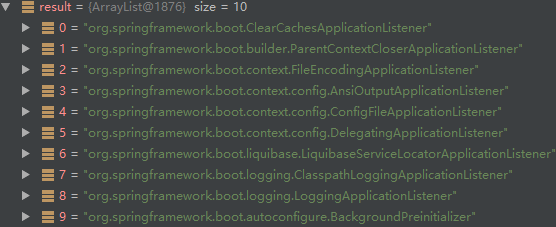

# SpringApplication

启动程序首先初始化了一个SpringApplication对象。来看一看在它的构造器了发生了什么。

```java
public SpringApplication(ResourceLoader resourceLoader, Object... sources) {
	this.resourceLoader = resourceLoader;
	initialize(sources);
}
```

initialize方法:

```java
private void initialize(Object[] sources) {
	if (sources != null && sources.length > 0) {
		this.sources.addAll(Arrays.asList(sources));
	}
	this.webEnvironment = deduceWebEnvironment();
	setInitializers((Collection) getSpringFactoriesInstances(
			ApplicationContextInitializer.class));
	setListeners((Collection) getSpringFactoriesInstances(ApplicationListener.class));
	this.mainApplicationClass = deduceMainApplicationClass();
}
```

## web环境检测

deduceWebEnvironment方法用于检测当前是否是web工程环境，检测的标准也很简单，classpath中必须同时存在下面这两个类:

- javax.servlet.Servlet
- org.springframework.web.context.ConfigurableWebApplicationContext

## ApplicationContextInitializer

下一步便是检测应当使用哪些ApplicationContextInitializer，这货并不是spring-boot的专属，而是定义在context下，这东西是在喜闻乐见的refesh方法执行之前留给我们进行自定义初始化的钩子。典型的使用的场景是注册我们自己的属性来源、设置激活的profile。

在简单的web应用场景下(没有数据库/mybatis)，共最终引入了下列的类:


来自于三个jar包:

- spring-boot
- spring-boot-autoconfigure
- spring-beans

## ApplicationListener

这货是典型的观察者模式实现，类图:


在简单的web应用场景下，系统共初始化了这些监听器:



## SpringApplicationRunListener

就像它长得那样，就是用来监听SpringApplication的run方法的监听器。看看这货用到了哪些实现类:


# run

从这一节开始，就进入了SpringApplication的run方法的势力范围。整个方法的流程总结如下图:


## 环境准备

相关源码:

```java
ConfigurableEnvironment environment = prepareEnvironment(listeners, applicationArguments);
```

Spring里面的Environment到底是个什么东西，详细参考隔壁(Spring.md)Environment接口一节，总结来说，这货就是属性配置来源(比如系统变量)和profile的综合体。

### 属性来源

在web环境下共初始化了以下4个属性来源:

- System.getProperties()
- System.getenv()
- servlet-context-init-params
- servlet-config-init-params


有意思的问题：此时servlet-context-init-params和servlet-config-init-params实际上是一个占位符，无法从这两个来源获得任何真实的属性，等到refresh方法执行时才会被真实的来源替换。

### profile配置

SpringApplication.configureProfiles方法:

```java
protected void configureProfiles(ConfigurableEnvironment environment, String[] args) {
	environment.getActiveProfiles(); // ensure they are initialized
	// But these ones should go first (last wins in a property key clash)
  	// 默认空
	Set<String> profiles = new LinkedHashSet<String>(this.additionalProfiles);
	profiles.addAll(Arrays.asList(environment.getActiveProfiles()));
	environment.setActiveProfiles(profiles.toArray(new String[profiles.size()]));
}
```

active profile取自上一节中的属性来源，key为`spring.profiles.active`.

