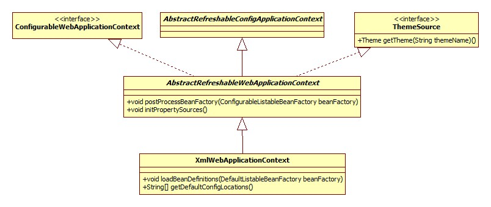
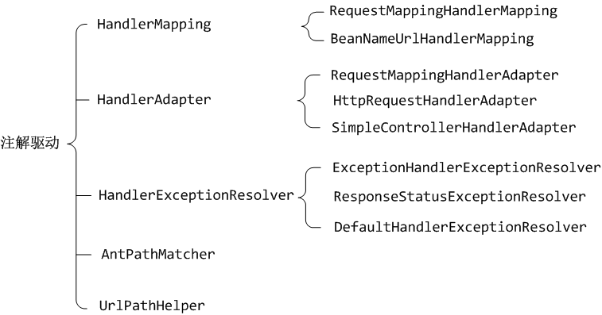
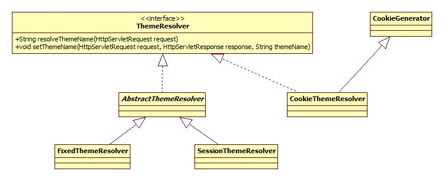
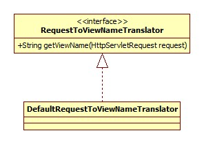
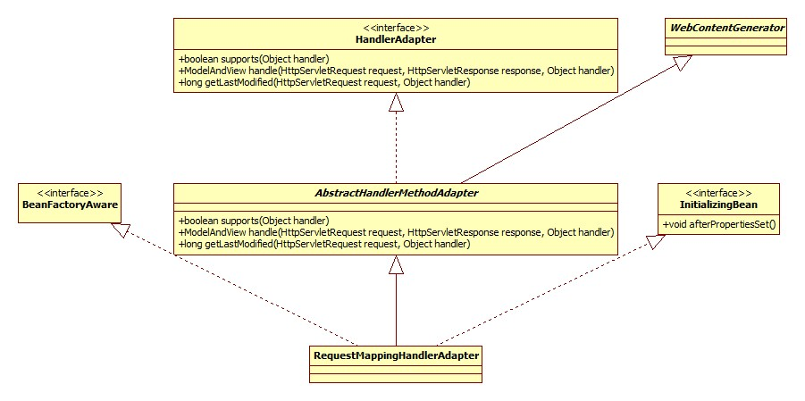

# 初始化

spring-mvc的核心便是DispatcherServlet，所以初始化也是围绕其展开的。类图:


Servlet标准定义了init方法是其声明周期的初始化方法。

HttpServletBean.init:

```java
@Override
public final void init() throws ServletException {
	// Set bean properties from init parameters.
	PropertyValues pvs = new ServletConfigPropertyValues(getServletConfig(), this.requiredProperties);
  	//包装DispatcherServlet，准备放入容器
	BeanWrapper bw = PropertyAccessorFactory.forBeanPropertyAccess(this);
  	//用以加载spring-mvc配置文件
	ResourceLoader resourceLoader = new ServletContextResourceLoader(getServletContext());
	bw.registerCustomEditor(Resource.class, new ResourceEditor(resourceLoader, getEnvironment()));
  	//没有子类实现此方法
	initBeanWrapper(bw);
	bw.setPropertyValues(pvs, true);
	// Let subclasses do whatever initialization they like.
	initServletBean();
}
```

主要逻辑一目了然。注意**setPropertyValues方法会导致对DispatcherServlet相关setter方法的调用，所以当进行容器初始化时从init-param中读取的参数已被设置到DispatcherServlet的相关字段(Field)中**。

## 容器初始化

FrameworkServlet.initServletBean简略版源码:

```java
@Override
protected final void initServletBean() {
	this.webApplicationContext = initWebApplicationContext();
  	//空实现，且没有子类覆盖
	initFrameworkServlet()
}
```

FrameworkServlet.initWebApplicationContext:

```java
protected WebApplicationContext initWebApplicationContext() {
  	//根容器查找
	WebApplicationContext rootContext =
			WebApplicationContextUtils.getWebApplicationContext(getServletContext());
	WebApplicationContext wac = null;
	if (this.webApplicationContext != null) {
      	//有可能DispatcherServlet被作为Spring bean初始化，且webApplicationContext已被注入进来
		wac = this.webApplicationContext;
		if (wac instanceof ConfigurableWebApplicationContext) {
			ConfigurableWebApplicationContext cwac = (ConfigurableWebApplicationContext) wac;
			if (!cwac.isActive()) {
				if (cwac.getParent() == null) {
					cwac.setParent(rootContext);
				}
				configureAndRefreshWebApplicationContext(cwac);
			}
		}
	}
	if (wac == null) {
      	//是否已经存在于ServletContext中
		wac = findWebApplicationContext();
	}
	if (wac == null) {
		wac = createWebApplicationContext(rootContext);
	}
	if (!this.refreshEventReceived) {
		onRefresh(wac);
	}
	if (this.publishContext) {
		String attrName = getServletContextAttributeName();
		getServletContext().setAttribute(attrName, wac);
	}
	return wac;
}
```

下面分部分展开。

### 根容器查找

spring-mvc支持Spring容器与MVC容器共存，此时，Spring容器即根容器，mvc容器将根容器视为父容器。

Spring容器(根容器)以下列形式进行配置(web.xml):

```xml
<listener>
	<listener-class>org.springframework.web.context.ContextLoaderListener</listener-class>
</listener>
```

根据Servlet规范，各组件的加载 顺序如下:

listener -> filter -> servlet

WebApplicationContextUtils.getWebApplicationContext:

```java
String ROOT_WEB_APPLICATION_CONTEXT_ATTRIBUTE = WebApplicationContext.class.getName() + ".ROOT";
public static WebApplicationContext getWebApplicationContext(ServletContext sc) {
	return getWebApplicationContext(sc, WebApplicationContext.ROOT_WEB_APPLICATION_CONTEXT_ATTRIBUTE);
}
```

两参数方法:

```java
public static WebApplicationContext getWebApplicationContext(ServletContext sc, String attrName) {
	Object attr = sc.getAttribute(attrName);
	if (attr == null) {
		return null;
	}
	return (WebApplicationContext) attr;
}
```

可以得出结论:

**如果Spring根容器存在，那么它被保存在ServletContext中，其key为`WebApplicationContext.class.getName() + ".ROOT"`。**

### 容器创建

FrameworkServlet.createWebApplicationContext:

```java
protected WebApplicationContext createWebApplicationContext(ApplicationContext parent) {
	Class<?> contextClass = getContextClass();
	if (!ConfigurableWebApplicationContext.class.isAssignableFrom(contextClass)) {
		throw new ApplicationContextException();
	}
	ConfigurableWebApplicationContext wac =
			(ConfigurableWebApplicationContext) BeanUtils.instantiateClass(contextClass);
	wac.setEnvironment(getEnvironment());
	wac.setParent(parent);
	wac.setConfigLocation(getContextConfigLocation());
	configureAndRefreshWebApplicationContext(wac);
	return wac;
}
```

通过对getContextClass方法的调用，Spring允许我们自定义容器的类型，即我们可以在web.xml中如下配置:

```xml
<servlet>
	<servlet-name>SpringMVC</servlet-name>
	<servlet-class>org.springframework.web.servlet.DispatcherServlet</servlet-class>
	<!-- 配置文件位置 -->
	<init-param>
		<param-name>contextConfigLocation</param-name>
		<param-value>classpath:spring-servlet.xml</param-value>
	</init-param>
  	<!-- 容器类型 -->
	<init-param>
		<param-name>contextClass</param-name>
		<param-value>java.lang.Object</param-value>
	</init-param>
</servlet>
```

configureAndRefreshWebApplicationContext核心源码:

```java
protected void configureAndRefreshWebApplicationContext(ConfigurableWebApplicationContext wac) {
	applyInitializers(wac);
	wac.refresh();
}
```

#### ApplicationContextInitializer

ApplicationContextInitializer允许我们在Spring(mvc)容器初始化之前干点坏事，可以通过init-param传入:

```xml
<init-param>
	<param-name>contextInitializerClasses</param-name>
	<param-value>坏事儿</param-value>
</init-param>
```

applyInitializers方法正是要触发这些坏事儿。类图:


#### 配置解析

"配置"指的便是spring-servlet.xml:

```xml
<context:component-scan base-package="controller"/>
<mvc:annotation-driven/>
<!-- 启用对静态资源使用默认servlet处理，非REST方式不需要 -->
<mvc:default-servlet-handler/>
<!-- 配置视图 -->
<bean class="org.springframework.web.servlet.view.UrlBasedViewResolver">
	<!-- viewClass属性必不可少 -->
    <property name="viewClass" value="org.springframework.web.servlet.view.JstlView"></property>
    <property name="prefix" value="/WEB-INF/"></property>
    <property name="suffix" value=".jsp"></property>
</bean>
```

而解析的入口便在于对refresh方法的调用，此方法位于AbstractApplicationContext，这一点在spring-core时已经见过了，下面我们重点关注不同于spring-core的地方。

对于spring-mvc来说，其容器默认为XmlWebApplicationContext，部分类图:



XmlWebApplicationContext通过重写loadBeanDefinitions方法改变了bean加载行为，使其指向spring-servlet.xml。

spring-servlet.xml中不同于spring-core的地方便在于引入了mvc命名空间，正如spring-core中笔记中所说的那样，**Spring用过jar包/META-INFO中的.handlers文件定义针对不同的命名空间所使用的解析器**。

mvc命名空间的解析器为MvcNamespaceHandler，部分源码:

```java
@Override
public void init() {
	registerBeanDefinitionParser("annotation-driven", new AnnotationDrivenBeanDefinitionParser());
	registerBeanDefinitionParser("default-servlet-handler", 
                                 new DefaultServletHandlerBeanDefinitionParser());
	registerBeanDefinitionParser("interceptors", new IanterceptorsBeanDefinitionParser());
	registerBeanDefinitionParser("view-resolvers", new ViewResolversBeanDefinitionParser());
}
```

老样子，按部分展开。

##### 注解驱动

其parse方法负责向Sprng容器注册一些必要的组件，整理如下图:



##### 静态资源处理

即:

```xml
<mvc:default-servlet-handler/>
```

DefaultServletHandlerBeanDefinitionParser.parse负责向容器注册以下三个组件:

- DefaultServletHttpRequestHandler
- SimpleUrlHandlerMapping
- HttpRequestHandlerAdapter

#####  拦截器

InterceptorsBeanDefinitionParser.parse方法负责**将每一项`mvc:interceptor`配置解析为一个MappedInterceptor bean并注册到容器中**。

##### 视图

有两种方式向Spring容器注册视图:

- 以前采用较土的方式:

  ```xml
  <bean class="org.springframework.web.servlet.view.UrlBasedViewResolver">
  	<!-- viewClass属性必不可少 -->
      <property name="viewClass" value="org.springframework.web.servlet.view.JstlView"></property>
      <property name="prefix" value="/WEB-INF/"></property>
      <property name="suffix" value=".jsp"></property>
  </bean>
  ```

- 通过特定的标签:

  ```xml
  <mvc:view-resolvers>
  	<mvc:jsp view-class="" />
  </mvc:view-resolvers>
  ```

从这里可以推测出: 拦截器同样支持第一种方式，Spring在查找时应该会查询某一接口的子类。

ViewResolversBeanDefinitionParser.parse方法的作用便是将每一个视图解析为ViewResolver并注册到容器。

#### Scope/处理器注册

AbstractRefreshableWebApplicationContext.postProcessBeanFactory:

```java
@Override
protected void postProcessBeanFactory(ConfigurableListableBeanFactory beanFactory) {
	beanFactory.addBeanPostProcessor(
      	new ServletContextAwareProcessor(this.servletContext, this.servletConfig));
	beanFactory.ignoreDependencyInterface(ServletContextAware.class);
	beanFactory.ignoreDependencyInterface(ServletConfigAware.class);
	WebApplicationContextUtils.registerWebApplicationScopes(beanFactory, this.servletContext);
	WebApplicationContextUtils.registerEnvironmentBeans(beanFactory, 
    	this.servletContext, this.servletConfig);
}
```

ServletContextAwareProcessor用以向实现了ServletContextAware的bean注册ServletContext。

registerWebApplicationScopes用以注册"request", "session", "globalSession", "application"四种scope，scope是个什么东西以及如何自定义，在spring-core中已经进行过说明了。

registerEnvironmentBeans用以将servletContext、servletConfig以及各种启动参数注册到Spring容器中。

## MVC初始化

入口位于DispatcherServlet的initStrategies方法(经由onRefresh调用):

```java
protected void initStrategies(ApplicationContext context) {
	initMultipartResolver(context);
	initLocaleResolver(context);
	initThemeResolver(context);
	initHandlerMappings(context);
	initHandlerAdapters(context);
	initHandlerExceptionResolvers(context);
	initRequestToViewNameTranslator(context);
	initViewResolvers(context);
	initFlashMapManager(context);
}
```

显然，这里就是spring-mvc的核心了。

### 文件上传支持

initMultipartResolver核心源码:

```java
private void initMultipartResolver(ApplicationContext context) {
	try {
		this.multipartResolver = context.getBean(MULTIPART_RESOLVER_BEAN_NAME, MultipartResolver.class);
	} catch (NoSuchBeanDefinitionException ex) {
		// Default is no multipart resolver.
		this.multipartResolver = null;
	}
}
```

MultipartResolver用于开启Spring MVC文件上传功能，其类图:


也就是说，如果我们要使用文件上传功能，须在容器中注册一个MultipartResolver bean。当然，默认是没有的。

### 地区解析器

LocaleResolver接口定义了Spring MVC如何获取客户端(浏览器)的地区，initLocaleResolver方法在容器中寻找此bean，如果没有，注册AcceptHeaderLocaleResolver，即根据request的请求头**Accept-Language**获取地区。

spring-mvc采用了属性文件的方式配置默认策略(即bean)，此文件位于spring-mvc的jar包的org.springframework.web.servlet下。

### 主题解析器

ThemeResolver接口配合Spring标签库使用可以通过动态决定使用的css以及图片的方式达到换肤的效果，其类图:



如果容器中不存在叫做themeResolver的bean，initThemeResolver方法将向容器中注册FixedThemeResolver，此bean只能提供一套默认的主题，名为theme。

### HandlerMapping检查

initHandlerMappings方法用于确保容器中**至少含有一个HandlerMapping对象**。从前面配置解析-注解驱动一节中可以看出，注解驱动导致已经注册了两个此对象。

如果没有开启注解驱动，那么将会使用默认的HandlerMapping，相关源码:

```java
if (this.handlerMappings == null) {
	this.handlerMappings = getDefaultStrategies(context, HandlerMapping.class);
	if (logger.isDebugEnabled()) {
		logger.debug("No HandlerMappings found in servlet '" + getServletName() + "': using default");
	}
}
```

前面提到了，默认的策略由DispatcherServlet.properties决定，**目前是BeanNameUrlHandlerMapping和DefaultAnnotationHandlerMapping**。

### HandlerAdapter检查

套路和上面完全一样，默认使用HttpRequestHandlerAdapter、SimpleControllerHandlerAdapter和AnnotationMethodHandlerAdapter。

### HandlerExceptionResolver检查

套路和上面完全一样，默认使用AnnotationMethodHandlerExceptionResolver、ResponseStatusExceptionResolver、DefaultHandlerExceptionResolver。

### RequestToViewNameTranslator

initRequestToViewNameTranslator方法回向容器中注册一个DefaultRequestToViewNameTranslator对象，此接口用以完成从HttpServletRequest到视图名的解析，其使用场景是**给定的URL无法匹配任何控制器时**。

DefaultRequestToViewNameTranslator的转换例子:

http://localhost:8080/gamecast/display.html -> display(视图)

其类图:



### ViewResolver检查

熟悉的套路，默认使用InternalResourceViewResolver。

### FlashMapManager

initFlashMapManager方法会向容器注册SessionFlashMapManager对象，类图:


此接口和FlashMap搭配使用，用于在**请求重定向时保存/传递参数**。

## HandlerMapping初始化

此接口用以根据请求的URL寻找合适的处理器。从前面配置解析一节可以看出，我们的容器中有三个HandlerMapping实现，下面以RequestMappingHandlerMapping位代表进行说明。

### RequestMappingHandlerMapping

此实现根据@Controller和@RequestMapping注解完成解析。类图(忽略部分接口):


初始化的入口位于AbstractHandlerMethodMapping的afterPropertiesSet方法和AbstractHandlerMapping的initApplicationContext方法，afterPropertiesSet调用了initHandlerMethods:

```java
protected void initHandlerMethods() {
  	//获取容器中所有的bean
	String[] beanNames = (this.detectHandlerMethodsInAncestorContexts ?
			BeanFactoryUtils.beanNamesForTypeIncludingAncestors(getApplicationContext(), Object.class) 			   :getApplicationContext().getBeanNamesForType(Object.class));
	for (String beanName : beanNames) {
		if (!beanName.startsWith(SCOPED_TARGET_NAME_PREFIX)) {
			Class<?> beanType = null;
			beanType = getApplicationContext().getType(beanName);
        	 //isHandler方法的原理:
             //判断类上有没有@Controller注解或者是@RequestMapping注解
			if (beanType != null && isHandler(beanType)) {
				detectHandlerMethods(beanName);
			}
		}
	}
  	//空实现
	handlerMethodsInitialized(getHandlerMethods());
}
```

detectHandlerMethods方法将反射遍历类中所有的public方法，如果方法上含有@RequestMapping注解，那么将方法上的路径与类上的基础路径(如果有)进行合并，之后将映射(匹配关系)注册到MappingRegistry中。

注意，**类上的@RequestMapping注解只能作为基路径存在，也就是说，如果类里面没有任何的方法级@RequestMapping注解，那么类上的注解是没有意义的**。这一点可以从实验和源码上得到证实。

下面我们关注一下映射关系是如何保存(注册)的。

内部类AbstractHandlerMethodMapping.MappingRegistry是映射的载体，类图:


其register方法简略版源码:

```java
public void register(T mapping, Object handler, Method method) {
  	//包装bean和方法
	HandlerMethod handlerMethod = createHandlerMethod(handler, method);
	this.mappingLookup.put(mapping, handlerMethod);
	List<String> directUrls = getDirectUrls(mapping);
	for (String url : directUrls) {
		this.urlLookup.add(url, mapping);
	}
	String name = null;
	if (getNamingStrategy() != null) {
		name = getNamingStrategy().getName(handlerMethod, mapping);
		addMappingName(name, handlerMethod);
	}
	CorsConfiguration corsConfig = initCorsConfiguration(handler, method, mapping);
	if (corsConfig != null) {
		this.corsLookup.put(handlerMethod, corsConfig);
	}
	this.registry.put(mapping, new MappingRegistration<T>(mapping, handlerMethod, directUrls, name));
}
```

mapping其实是一个RequestMappingInfo对象，可以将其看做是**@RequestMapping注解各种属性的一个封装**。最终由RequestMappingInfo.createRequestMappingInfo方法创建，源码:

```java
protected RequestMappingInfo createRequestMappingInfo(
		RequestMapping requestMapping, RequestCondition<?> customCondition) {
	return RequestMappingInfo
			.paths(resolveEmbeddedValuesInPatterns(requestMapping.path()))
			.methods(requestMapping.method())
			.params(requestMapping.params())
			.headers(requestMapping.headers())
			.consumes(requestMapping.consumes())
			.produces(requestMapping.produces())
			.mappingName(requestMapping.name())
			.customCondition(customCondition)
			.options(this.config)
			.build();
}
```

这就很明显了，具体每种属性什么意义可以参考@RequestMapping源码。

register方法中urlLookup其实就是将paths属性中的每个path都与处理器做映射。

getNamingStrategy方法得到的是一个HandlerMethodMappingNamingStrategy接口的实例，此接口用以根据HandlerMethod得到一个名字，类图:


比如对于我们的控制器,SimpleController.echo方法，最终得到的名字将是SC#echo。

#### 跨域请求

spring-mvc自4.2开启加入了跨域请求Cors的支持，主要有两种配置方式:

- xml:

  ```xml
  <mvc:cors>
  	<mvc:mapping path=""/>
  </mvc:cors>
  ```

- @CrossOrigin注解。

Cors的原理可以参考:

[探讨跨域请求资源的几种方式](http://www.cnblogs.com/dojo-lzz/p/4265637.html)

而initCorsConfiguration方法的作用便是将@CrossOrigin注解的各种属性封装在CorsConfiguration中。

#### 拦截器初始化

AbstractHandlerMapping.initApplicationContext:

```java
@Override
protected void initApplicationContext() throws BeansException {
	detectMappedInterceptors(this.adaptedInterceptors);
}
```

作用就是从容器中获取所有MappedInterceptor bean并放到adaptedInterceptors中，前面提到过了，我们使用mvc:interceptor定义的拦截器其实就是MappedInterceptor对象。类图:


## HandlerAdapter初始化

同样，我们以RequestMappingHandlerAdapter为例进行说明，类图:



显然，入口在afterPropertiesSet方法:

```java
@Override
public void afterPropertiesSet() {
	// Do this first, it may add ResponseBody advice beans
	initControllerAdviceCache();
	if (this.argumentResolvers == null) {
		List<HandlerMethodArgumentResolver> resolvers = getDefaultArgumentResolvers();
		this.argumentResolvers = new HandlerMethodArgumentResolverComposite()
			.addResolvers(resolvers);
	}
	if (this.initBinderArgumentResolvers == null) {
		List<HandlerMethodArgumentResolver> resolvers = getDefaultInitBinderArgumentResolvers();
		this.initBinderArgumentResolvers = new HandlerMethodArgumentResolverComposite()
			.addResolvers(resolvers);
	}
	if (this.returnValueHandlers == null) {
		List<HandlerMethodReturnValueHandler> handlers = getDefaultReturnValueHandlers();
		this.returnValueHandlers = new HandlerMethodReturnValueHandlerComposite()
			.addHandlers(handlers);
	}
}
```

### @ControllerAdvice

initControllerAdviceCache方法用以解析并存储标注了@ControllerAdvice的bean，这东西是干什么的参考：

[Spring3.2新注解@ControllerAdvice](http://jinnianshilongnian.iteye.com/blog/1866350)

### 参数解析器

HandlerMethodArgumentResolver即参数解析器，负责从request中解析、得到Controller方法所需的参数。afterPropertiesSet方法设置了一组默认的解析器。具体是哪些参考getDefaultArgumentResolvers方法。类图:


### @InitBinder支持

此注解定义的其实是自定义类型转换器。使用方法参考:

[springMVC @initBinder 使用](http://blog.csdn.net/songzaiblog/article/details/49757253)

getDefaultInitBinderArgumentResolvers返回了一组默认使用的转换器，不过其实这里的转换器和上面的参数解析器其实是一个类型的，这里留个坑。

### 返回结果解析器

HandlerMethodReturnValueHandler接口用以处理方法调用(Controller方法)的返回值，类图:


getDefaultReturnValueHandlers方法便返回了一坨这东西。

# 请求响应

我们先来看一下入口在哪。众所周知，Servlet标准定义了所有请求先由service方法处理，如果是get或post方法，那么再交由doGet或是doPost方法处理。

FrameworkServlet覆盖了service方法:

```java
@Override
protected void service(HttpServletRequest request, HttpServletResponse response) {
	HttpMethod httpMethod = HttpMethod.resolve(request.getMethod());
	if (HttpMethod.PATCH == httpMethod || httpMethod == null) {
		processRequest(request, response);
	} else {
		super.service(request, response);
	}
}
```

Spring要覆盖此方法的目的在于拦截PATCH请求，PATCH请求与PUT类似，不同在于PATCH是局部更新，而后者是全部更新。可以参考:

[PATCH和PUT方法的区别？](https://segmentfault.com/q/1010000005685904)

FrameworkServlet同样也覆盖了doGet和doPost方法，两者只是调用processRequest方法。

## 请求上下文

Spring MVC会在请求分发之前进行上下文的准备工作，含两部分:

1. 将地区(Locale)和请求属性以ThreadLocal的方法与当前线程进行关联，分别可以通过LocaleContextHolder和RequestContextHolder进行获取。
2. 将WebApplicationContext、FlashMap等组件放入到Request属性中。

## 请求分发

DispatcherServlet.doDispatch简略版源码:

```java
protected void doDispatch(HttpServletRequest request, HttpServletResponse response) {
	HandlerExecutionChain mappedHandler = getHandler(processedRequest);
	HandlerAdapter ha = getHandlerAdapter(mappedHandler.getHandler());
	mv = ha.handle(processedRequest, response, mappedHandler.getHandler());
	applyDefaultViewName(processedRequest, mv);
	mappedHandler.applyPostHandle(processedRequest, response, mv);
	processDispatchResult(processedRequest, response, mappedHandler, mv, dispatchException);
}
```

### 处理器查找

即为请求寻找合适的Controller的过程。DispatcherServlet.getHandler:

```java
protected HandlerExecutionChain getHandler(HttpServletRequest request) {
	for (HandlerMapping hm : this.handlerMappings) {
		HandlerExecutionChain handler = hm.getHandler(request);
		if (handler != null) {
			return handler;
		}
	}
	return null;
}
```

从这里可以看出，寻找处理器实际上委托给HandlerMapping实现，寻找的过程便是遍历所有的HandlerMapping进行查找，**一旦找到，那么不再继续进行遍历**。也就是说HandlerMapping之间有优先级的概念，而根据AnnotationDrivenBeanDefinitionParser的注释，RequestMappingHandlerMapping其实有最高的优先级。

AbstractHandlerMapping.getHandler:

```java
@Override
public final HandlerExecutionChain getHandler(HttpServletRequest request) throws Exception {
	Object handler = getHandlerInternal(request);
	HandlerExecutionChain executionChain = getHandlerExecutionChain(handler, request);
  	//判断请求头中是否有ORIGIN字段
	if (CorsUtils.isCorsRequest(request)) {
		CorsConfiguration globalConfig = this.corsConfigSource.getCorsConfiguration(request);
		CorsConfiguration handlerConfig = getCorsConfiguration(handler, request);
		CorsConfiguration config = (globalConfig != null ? 
			globalConfig.combine(handlerConfig) : handlerConfig);
		executionChain = getCorsHandlerExecutionChain(request, executionChain, config);
	}
	return executionChain;
}
```

getHandlerInternal方法便是根据url进行查找的过程，可以参见MVC初始化-HandlerMapping初始化一节。下面重点是执行链的生成。

getHandlerExecutionChain方法的原理就是从adaptedInterceptors中获得所有可以适配当前请求URL的MappedInterceptor并将其添加到HandlerExecutionChain的拦截器列表中。拦截器的顺序其实就是我们定义/注册的顺序。

从getCorsHandlerExecutionChain的源码中可以看出，对于跨域请求其实是向调用链插入了一个CorsInterceptor。

### 适配器查找

DispatcherServlet.getHandlerAdapter:

```java
protected HandlerAdapter getHandlerAdapter(Object handler) {
	for (HandlerAdapter ha : this.handlerAdapters) {
		if (ha.supports(handler)) {
			return ha;
		}
	}
}
```

从前面配置解析-注解驱动可以看出，第一个适配器是RequestMappingHandlerAdapter，而其support方法直接返回true，这就导致了使用的适配器总是这一个。

## 请求处理

RequestMappingHandlerAdapter.handleInternal:

```java
@Override
protected ModelAndView handleInternal(HttpServletRequest request,
		HttpServletResponse response, HandlerMethod handlerMethod){
	ModelAndView mav;
	// Execute invokeHandlerMethod in synchronized block if required.
	if (this.synchronizeOnSession) {
		HttpSession session = request.getSession(false);
		if (session != null) {
			Object mutex = WebUtils.getSessionMutex(session);
			synchronized (mutex) {
				mav = invokeHandlerMethod(request, response, handlerMethod);
			}
		} else {
			// No HttpSession available -> no mutex necessary
			mav = invokeHandlerMethod(request, response, handlerMethod);
		}
	} else {
		// No synchronization on session demanded at all...
		mav = invokeHandlerMethod(request, response, handlerMethod);
	}
	if (!response.containsHeader(HEADER_CACHE_CONTROL)) {
		if (getSessionAttributesHandler(handlerMethod).hasSessionAttributes()) {
			applyCacheSeconds(response, this.cacheSecondsForSessionAttributeHandlers);
		}
		else {
			prepareResponse(response);
		}
	}
	return mav;
}
```

### Session同步

可以看出，如果开启了synchronizeOnSession，那么**同一个session的请求将会串行执行**，这一选项默认是关闭的，当然我们可以通过注入的方式进行改变。