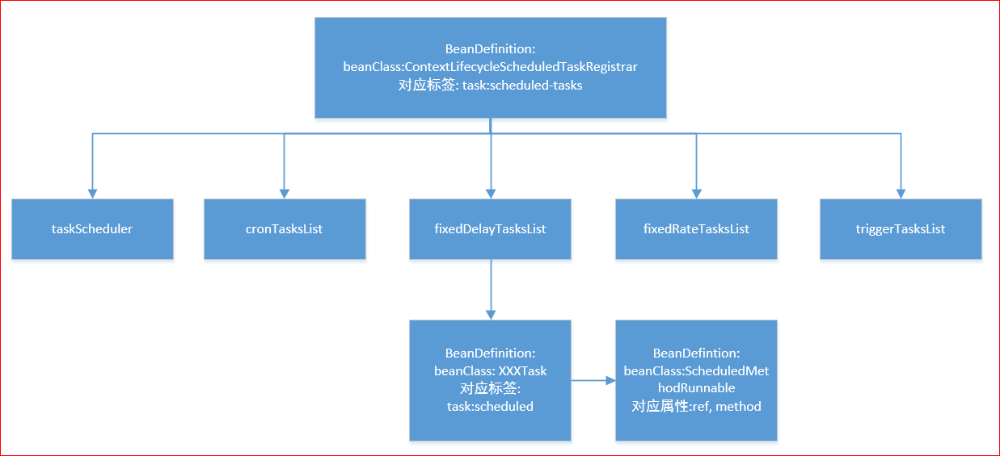

# 开头

从功能上来说，spring-task这个组件主要包括了两个/两种功能:

- 任务的定时调度/执行，对应xml配置的task:scheduler和task:scheduled-tasks标签。
- 方法异步执行，对应xml配置的task:executor标签。

task:annotation-driven标签被以上两种功能共有。下面就这两种功能分别进行说明。

# 定时器

## 用法

以XML作为示例，基于注解的也是一样的。

```xml
<task:scheduler id="scheduler" pool-size="3" />
<bean id="task" class="task.Task"/>
<task:scheduled-tasks scheduler="scheduler">
	<task:scheduled ref="task" method="print" cron="0/5 * * * * ?"/>
</task:scheduled-tasks>
```

定义了一个定时任务，每隔5秒执行Task的print方法，Task:

```java
public class Task {
    public void print() {
        System.out.println("print执行");
    }
}
```

关于cron表达式可以参考:

[深入浅出Spring task定时任务](http://blog.csdn.net/u011116672/article/details/52517247)

## 解析

### 注册

此部分的解析器注册由TaskNamespaceHandler完成:

```java
@Override
public void init() {
	this.registerBeanDefinitionParser("annotation-driven", new AnnotationDrivenBeanDefinitionParser());
	this.registerBeanDefinitionParser("executor", new ExecutorBeanDefinitionParser());
	this.registerBeanDefinitionParser("scheduled-tasks", new ScheduledTasksBeanDefinitionParser());
	this.registerBeanDefinitionParser("scheduler", new SchedulerBeanDefinitionParser());
}
```

### scheduler

SchedulerBeanDefinitionParser源码:

```java
@Override
protected String getBeanClassName(Element element) {
	return "org.springframework.scheduling.concurrent.ThreadPoolTaskScheduler";
}

@Override
protected void doParse(Element element, BeanDefinitionBuilder builder) {
	String poolSize = element.getAttribute("pool-size");
	if (StringUtils.hasText(poolSize)) {
		builder.addPropertyValue("poolSize", poolSize);
	}
}
```

由于SchedulerBeanDefinitionParser是AbstractSingleBeanDefinitionParser的子类，所以Spring将task:scheduler标签解析为一个BeanDefinition。其beanClass为org.springframework.scheduling.concurrent.ThreadPoolTaskScheduler。

### scheduled-tasks

其解析的源码较长，在此不再贴出，解析之后形成的BeanDefinition结构如下图:




taskScheduler属性即指向task:scheduler标签，如果没有配置，此属性不存在。

Spring将每一个task:scheduled标签解析为一个Task(的子类)，其类图如下:


很明显可以看出，任务的类型是由cron, fixed-delay, fixed-rate, trigger四个属性决定的，fixed-delay和fixed-rate为IntervalTask。

注意一点: **四种任务集合并不是互斥的**。比如说一个task:scheduled标签同时配置了cron和trigger属性，那么此标签会导致生成两个beanClass分别为CronTask何TriggerTask的BeanDefinition产生，并分别被放到cronTasksList和triggerTasksList中。

从图中可以看出，task:scheduled的method和ref属性也被包装成了一个BeanDefinition, 其beanClass为org.springframework.scheduling.support.ScheduledMethodRunnable.

## 初始化

