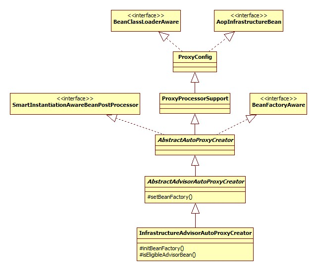
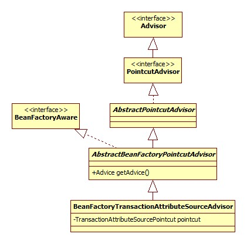
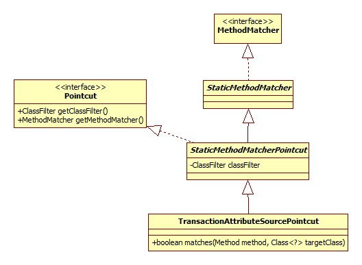
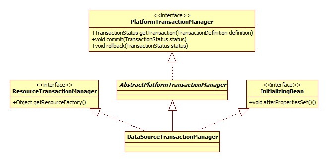
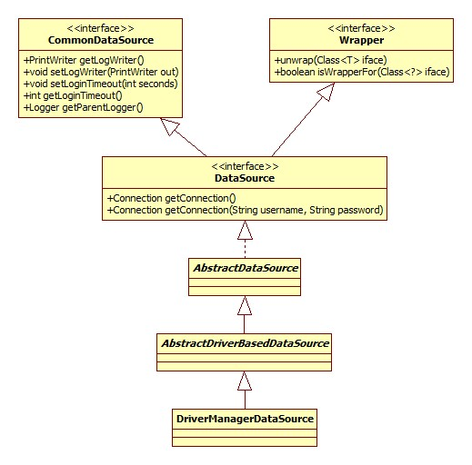
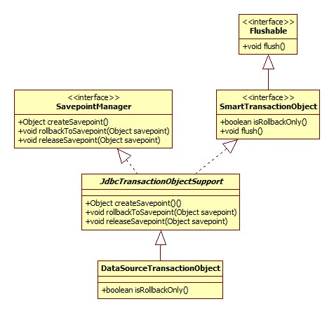
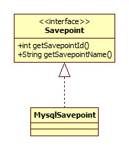

# 配置

以最简单的jdbc事务为例:

```xml
<!-- 数据源以Sping自带为例，每次请求均返回一个新的连接 -->
<bean id="dataSource" class="org.springframework.jdbc.datasource.DriverManagerDataSource">
	<property name="driverClassName" value="${jdbc.driverClassName}" />
	<property name="url" value="${jdbc.url}" />
    <property name="username" value="${jdbc.username}" />
    <property name="password" value="${jdbc.password}" />
</bean>
<bean id="transactionManager" class="org.springframework.jdbc.datasource.DataSourceTransactionManager">
	<property name="dataSource" ref="dataSource"/>
</bean>
<tx:annotation-driven transaction-manager="transactionManager"/>
```

# 解析

TxNamespaceHandler.init:

```java
@Override
public void init() {
	registerBeanDefinitionParser("advice", new TxAdviceBeanDefinitionParser());
	registerBeanDefinitionParser("annotation-driven", 
        new AnnotationDrivenBeanDefinitionParser());
	registerBeanDefinitionParser("jta-transaction-manager", new JtaTransactionManagerBeanDefinitionParser());
}
```

明显解析的入口便在AnnotationDrivenBeanDefinitionParser.parse:

```java
@Override
public BeanDefinition parse(Element element, ParserContext parserContext) {
	registerTransactionalEventListenerFactory(parserContext);
	String mode = element.getAttribute("mode");
	if ("aspectj".equals(mode)) {
		// mode="aspectj"
		registerTransactionAspect(element, parserContext);
	} else {
		// mode="proxy"
		AopAutoProxyConfigurer.configureAutoProxyCreator(element, parserContext);
	}
	return null;
}
```

下面分部分进行说明。

##  TransactionalEventListener

第一部分用于向Spring容器注册TransactionalEventListener工厂，TransactionalEventListener是Spring4.2引入的新特性，允许我们自定义监听器监听事务的提交或其它动作。

## 主要组件注册

即configureAutoProxyCreator方法，此方法的最终作用便是在Spring容器中加入这样的bean结构:

BeanFactoryTransactionAttributeSourceAdvisor->TransactionInterceptor->AnnotationTransactionAttributeSource

其中AnnotationTransactionAttributeSource用于解析@Transactional注解的相关属性。

## 代理类生成

与aop模块类似，入口位于configureAutoProxyCreator里注册的bean: InfrastructureAdvisorAutoProxyCreator，其类图:



此类的特殊之处从其名字上可以体现: **只考虑Spring内部使用的基础设施Advisor**。

为类创建代理的入口位于AbstractAutoProxyCreator.postProcessAfterInitialization:

```java
@Override
public Object postProcessAfterInitialization(Object bean, String beanName) throws BeansException {
	if (bean != null) {
		Object cacheKey = getCacheKey(bean.getClass(), beanName);
		if (!this.earlyProxyReferences.contains(cacheKey)) {
			return wrapIfNecessary(bean, beanName, cacheKey);
		}
	}
	return bean;
}
```

wrapIfNecessary核心逻辑:

```java
protected Object wrapIfNecessary(Object bean, String beanName, Object cacheKey) {
	// Create proxy if we have advice.
	Object[] specificInterceptors = getAdvicesAndAdvisorsForBean(bean.getClass(), beanName, null);
	if (specificInterceptors != DO_NOT_PROXY) {
		this.advisedBeans.put(cacheKey, Boolean.TRUE);
		Object proxy = createProxy(
			bean.getClass(), beanName, specificInterceptors, new SingletonTargetSource(bean));
		this.proxyTypes.put(cacheKey, proxy.getClass());
		return proxy;
	}
}
```

### Advisor寻找

getAdvicesAndAdvisorsForBean用于去容器中寻找适合当前bean的Advisor，其最终调用AbstractAdvisorAutoProxyCreator.findEligibleAdvisors:

```java
protected List<Advisor> findEligibleAdvisors(Class<?> beanClass, String beanName) {
	List<Advisor> candidateAdvisors = findCandidateAdvisors();
	List<Advisor> eligibleAdvisors = findAdvisorsThatCanApply(candidateAdvisors, beanClass, beanName);
	extendAdvisors(eligibleAdvisors);
	if (!eligibleAdvisors.isEmpty()) {
      	//按照@Ordered排序
		eligibleAdvisors = sortAdvisors(eligibleAdvisors);
	}
	return eligibleAdvisors;
}
```

这个方法在spring-aop中已经详细说明过了，这里再强调一下具体的查找逻辑:

- 首先去容器找出所有实现了Advisor接口的bean，对应findCandidateAdvisors方法.
- 逐一判断Advisor是否适用于当前bean，对应findAdvisorsThatCanApply方法，判断逻辑为:
  - 如果Advisor是IntroductionAdvisor，那么判断其ClassFilter是否可以匹配bean的类.
  - 如果Advisor是PointcutAdvisor，那么首先进行ClassFilter匹配，如果匹配失败，那么再获得Advisor的MethodMatcher对象，如果MethodMatcher可以匹配任意方法，那么返回true，否则反射获取给定bean的所有方法逐一进行匹配，只要有一个匹配成功，即返回true.
  - 其它情况，直接返回true.

对于spring事务来说，我们有唯一的Advisor: BeanFactoryTransactionAttributeSourceAdvisor,其类图:



可以看出，BeanFactoryTransactionAttributeSourceAdvisor其实是一个PointcutAdvisor，所以**是否可以匹配取决于其Pointcut**。此Advisor的pointcut是一个TransactionAttributeSourcePointcut对象，类图:



**Pointcut的核心在于其ClassFilter和MethodMatcher**。

ClassFilter:

位于StaticMethodMatcherPointcut:

```java
private ClassFilter classFilter = ClassFilter.TRUE;
```

即: 类检查全部通过。

MethodMatcher:

TransactionAttributeSourcePointcut.matches:

```java
@Override
public boolean matches(Method method, Class<?> targetClass) {
  	//如果已经是事务代理，那么不应该再次代理
	if (TransactionalProxy.class.isAssignableFrom(targetClass)) {
		return false;
	}
	TransactionAttributeSource tas = getTransactionAttributeSource();
	return (tas == null || tas.getTransactionAttribute(method, targetClass) != null);
}
```

getTransactionAttribute方法使用了缓存的思想，但其核心逻辑位于AbstractFallbackTransactionAttributeSource.computeTransactionAttribute:

```java
protected TransactionAttribute computeTransactionAttribute(Method method, Class<?> targetClass) {
	// Don't allow no-public methods as required.
	if (allowPublicMethodsOnly() && !Modifier.isPublic(method.getModifiers())) {
		return null;
	}
	// Ignore CGLIB subclasses - introspect the actual user class.
	Class<?> userClass = ClassUtils.getUserClass(targetClass);
	// The method may be on an interface, but we need attributes from the target class.
	// If the target class is null, the method will be unchanged.
	Method specificMethod = ClassUtils.getMostSpecificMethod(method, userClass);
	// If we are dealing with method with generic parameters, find the original method.
	specificMethod = BridgeMethodResolver.findBridgedMethod(specificMethod);
	// First try is the method in the target class.
	TransactionAttribute txAtt = findTransactionAttribute(specificMethod);
	if (txAtt != null) {
		return txAtt;
	}
	// Second try is the transaction attribute on the target class.
	txAtt = findTransactionAttribute(specificMethod.getDeclaringClass());
	if (txAtt != null && ClassUtils.isUserLevelMethod(method)) {
		return txAtt;
	}
	if (specificMethod != method) {
		// Fallback is to look at the original method.
		txAtt = findTransactionAttribute(method);
		if (txAtt != null) {
			return txAtt;
		}
		// Last fallback is the class of the original method.
		txAtt = findTransactionAttribute(method.getDeclaringClass());
		if (txAtt != null && ClassUtils.isUserLevelMethod(method)) {
			return txAtt;
		}
	}
	return null;
}
```

很明显可以看出，**首先去方法上查找是否有相应的事务注解(比如@Transactional)，如果没有，那么再去类上查找**。

# 运行

以JDK动态代理为例，JdkDynamicAopProxy.invoke简略版源码:

```java
@Override
public Object invoke(Object proxy, Method method, Object[] args) throws Throwable {
	List<Object> chain = this.advised.getInterceptorsAndDynamicInterceptionAdvice(method, targetClass);
	if (chain.isEmpty()) {.
      	//没有可用的拦截器，直接调用原方法
		Object[] argsToUse = AopProxyUtils.adaptArgumentsIfNecessary(method, args);
		retVal = AopUtils.invokeJoinpointUsingReflection(target, method, argsToUse);
	} else {
		// We need to create a method invocation...
		invocation = new ReflectiveMethodInvocation(proxy, target, method, args, targetClass, chain);
		// Proceed to the joinpoint through the interceptor chain.
		Object retVal = invocation.proceed();
	}
}
```

## 调用链生成

即getInterceptorsAndDynamicInterceptionAdvice方法，其原理是:

**遍历所有使用的 Advisor，获得其Advice，将Advice转为MethodInterceptor**。那么是如何转的呢?

根据Spring的定义，Advice可以是一个MethodInterceptor，也可以是类似于Aspectj的before, after通知。转换由DefaultAdvisorAdapterRegistry.getInterceptors完成:

```java
@Override
public MethodInterceptor[] getInterceptors(Advisor advisor) throws UnknownAdviceTypeException {
	List<MethodInterceptor> interceptors = new ArrayList<MethodInterceptor>(3);
	Advice advice = advisor.getAdvice();
	if (advice instanceof MethodInterceptor) {
		interceptors.add((MethodInterceptor) advice);
	}
	for (AdvisorAdapter adapter : this.adapters) {
		if (adapter.supportsAdvice(advice)) {
			interceptors.add(adapter.getInterceptor(advisor));
		}
	}
	if (interceptors.isEmpty()) {
		throw new UnknownAdviceTypeException(advisor.getAdvice());
	}
	return interceptors.toArray(new MethodInterceptor[interceptors.size()]);
}
```

AdvisorAdapter接口用以支持用户自定义的Advice类型，并将自定义的类型转为拦截器。默认adapters含有MethodBeforeAdviceAdapter、AfterReturningAdviceAdapter和ThrowsAdviceAdapter三种类型，用以分别支持MethodBeforeAdvice、AfterReturningAdvice和ThrowsAdvice。

**对于我们的BeanFactoryTransactionAttributeSourceAdvisor来说，有且只有一个拦截器: TransactionInterceptor**.

## 调用链调用

ReflectiveMethodInvocation.proceed:

```java
@Override
public Object proceed() throws Throwable {
	if (this.currentInterceptorIndex == this.interceptorsAndDynamicMethodMatchers.size() - 1) {
      	//拦截器执行完毕，调用原本的方法
		return invokeJoinpoint();
	}
	Object interceptorOrInterceptionAdvice =
			this.interceptorsAndDynamicMethodMatchers.get(++this.currentInterceptorIndex);
	if (interceptorOrInterceptionAdvice instanceof InterceptorAndDynamicMethodMatcher) {
		InterceptorAndDynamicMethodMatcher dm =
				(InterceptorAndDynamicMethodMatcher) interceptorOrInterceptionAdvice;
		if (dm.methodMatcher.matches(this.method, this.targetClass, this.arguments)) {
			return dm.interceptor.invoke(this);
		} else {
			// Dynamic matching failed.
			return proceed();
		}
	} else {
      	//调用拦截器的invoke方法
		return ((MethodInterceptor) interceptorOrInterceptionAdvice).invoke(this);
	}
}
```

可以看出，这其实是一个**逐个调用拦截器的invoke方法，最终调用原本方法(被代理方法)的过程**。所以，事务添加的核心逻辑(入口)在TransactionInterceptor的invoke方法。

## TransactionInterceptor

invoke方法:

```java
@Override
public Object invoke(final MethodInvocation invocation) throws Throwable {
	Class<?> targetClass = (invocation.getThis() != null ? 
             AopUtils.getTargetClass(invocation.getThis()) : null);
	// Adapt to TransactionAspectSupport's invokeWithinTransaction...
	return invokeWithinTransaction(invocation.getMethod(), targetClass, new InvocationCallback() {
		@Override
		public Object proceedWithInvocation() throws Throwable {
          	//事务执行完毕后调用链继续向下执行
			return invocation.proceed();
		}
	});
}
```

invokeWithinTransaction简略版源码(仅保留PlatformTransactionManager部分):

```java
protected Object invokeWithinTransaction(Method method, Class<?> targetClass, final InvocationCallback invocation){
	// If the transaction attribute is null, the method is non-transactional.
	final TransactionAttribute txAttr = getTransactionAttributeSource()
      	.getTransactionAttribute(method, targetClass);
	final PlatformTransactionManager tm = determineTransactionManager(txAttr);
  	//得到方法名
	final String joinpointIdentification = methodIdentification(method, targetClass);
	if (txAttr == null || !(tm instanceof CallbackPreferringPlatformTransactionManager)) {
		// Standard transaction demarcation with getTransaction and commit/rollback calls.
		TransactionInfo txInfo = createTransactionIfNecessary(tm, txAttr, joinpointIdentification);
		Object retVal = null;
		try {
			// This is an around advice: Invoke the next interceptor in the chain.
			// This will normally result in a target object being invoked.
			retVal = invocation.proceedWithInvocation();
		} catch (Throwable ex) {
			// target invocation exception
			completeTransactionAfterThrowing(txInfo, ex);
			throw ex;
		} finally {
			cleanupTransactionInfo(txInfo);
		}
		commitTransactionAfterReturning(txInfo);
		return retVal;
	}
}
```

### 事务管理器

determineTransactionManager方法用以确定使用的事务管理器:

```java
protected PlatformTransactionManager determineTransactionManager(TransactionAttribute txAttr) {
	//如果没有事务属性，那么仅从缓存中查找，找不到返回null
	if (txAttr == null || this.beanFactory == null) {
		return getTransactionManager();
	}
	String qualifier = txAttr.getQualifier();
  	//如果@Transactional注解配置了transactionManager或value属性(用以决定使用哪个事务管理器):
  	//首先查找缓存，找不到再去容器中按名称寻找
	if (StringUtils.hasText(qualifier)) {
		return determineQualifiedTransactionManager(qualifier);
	} else if (StringUtils.hasText(this.transactionManagerBeanName)) {
		return determineQualifiedTransactionManager(this.transactionManagerBeanName);
	} else {
      	//去容器中按类型(Class)查找
		PlatformTransactionManager defaultTransactionManager = getTransactionManager();
		if (defaultTransactionManager == null) {
			defaultTransactionManager = this.beanFactory.getBean(PlatformTransactionManager.class);
			this.transactionManagerCache.putIfAbsent(
					DEFAULT_TRANSACTION_MANAGER_KEY, defaultTransactionManager);
		}
		return defaultTransactionManager;
	}
}
```

对于我们使用的DataSourceTransactionManager，类图:



afterPropertiesSet方法只是对dataSource进行了检查。

### DataSource

DriverManagerDataSource类图:



其中CommonDataSource、Wrapper、DataSource均位于javax.sql包下。

### 事务开启

invocation.proceedWithInvocation()便是我们的逻辑，而createTransactionIfNecessary便是在逻辑执行前开启事务。

TransactionAspectSupport.createTransactionIfNecessary:

```java
protected TransactionInfo createTransactionIfNecessary(
	PlatformTransactionManager tm, TransactionAttribute txAttr, final String joinpointIdentification) {
	// If no name specified, apply method identification as transaction name.
	if (txAttr != null && txAttr.getName() == null) {
		txAttr = new DelegatingTransactionAttribute(txAttr) {
			@Override
			public String getName() {
				return joinpointIdentification;
			}
		};
	}
	TransactionStatus status = null;
	if (txAttr != null) {
		if (tm != null) {
			status = tm.getTransaction(txAttr);
		}
	}
	return prepareTransactionInfo(tm, txAttr, joinpointIdentification, status);
}
```

此部分的核心逻辑在getTransaction和prepareTransactionInfo方法，源码较长，下面依然按部分整理。

#### 是否已存在事务

目的在于支撑事务的传播性。

源码位于DataSourceTransactionManager.doGetTransaction，核心逻辑在TransactionSynchronizationManager.doGetResource:

```java
private static Object doGetResource(Object actualKey) {
	Map<Object, Object> map = resources.get();
	if (map == null) {
		return null;
	}
	Object value = map.get(actualKey);
	// Transparently remove ResourceHolder that was marked as void...
	if (value instanceof ResourceHolder && ((ResourceHolder) value).isVoid()) {
		map.remove(actualKey);
		// Remove entire ThreadLocal if empty...
		if (map.isEmpty()) {
			resources.remove();
		}
		value = null;
	}
	return value;
}
```

actualKey实际上是DataSource对象，resources是一个ThreadLocal对象，其声明源码:

```java
private static final ThreadLocal<Map<Object, Object>> resources =
			new NamedThreadLocal<Map<Object, Object>>("Transactional resources");
```

从这里可以得出结论:

**是否存在事务指的是在当前线程、当前数据源(DataSource)中是否存在处于活动状态的事务**。

#### 事务已存在

如果检测到已存在事务，那么就要考虑事务的传播特性(行为).此部分源码位于AbstractPlatformTransactionManager.handleExistingTransaction，下面按照不同的传播特性展开。

##### PROPAGATION_NEVER

即当前方法需要在非事务的环境下执行，如果有事务存在，那么抛出异常。相关源码:

```java
if (definition.getPropagationBehavior() == TransactionDefinition.PROPAGATION_NEVER) {
	throw new IllegalTransactionStateException(
		"Existing transaction found for transaction marked with propagation 'never'");
}
```

##### PROPAGATION_NOT_SUPPORTED

与前者的区别在于，如果有事务存在，那么将事务挂起，而不是抛出异常。

```java
if (definition.getPropagationBehavior() == TransactionDefinition.PROPAGATION_NOT_SUPPORTED) {
	Object suspendedResources = suspend(transaction);
	boolean newSynchronization = (getTransactionSynchronization() == SYNCHRONIZATION_ALWAYS);
	return prepareTransactionStatus(
		definition, null, false, newSynchronization, debugEnabled, suspendedResources);
}
```

###### 事务挂起

此部分的核心在于suspend方法，最终调用TransactionSynchronizationManager.doUnbindResource:

```java
private static Object doUnbindResource(Object actualKey) {
	Map<Object, Object> map = resources.get();
	if (map == null) {
		return null;
	}
	Object value = map.remove(actualKey);
	// Remove entire ThreadLocal if empty...
	if (map.isEmpty()) {
		resources.remove();
	}
	// Transparently suppress a ResourceHolder that was marked as void...
	if (value instanceof ResourceHolder && ((ResourceHolder) value).isVoid()) {
		value = null;
	}
	return value;
}
```

可以看出，**所谓的事务挂起其实就是一个移除当前线程、数据源活动事务对象的过程**。

同时注意getTransaction方法返回的是一个TransactionStatus对象，**被挂起的事务的各种状态都被保存在此对象中**。

##### PROPAGATION_REQUIRES_NEW

```java
if (definition.getPropagationBehavior() == TransactionDefinition.PROPAGATION_REQUIRES_NEW) {
	SuspendedResourcesHolder suspendedResources = suspend(transaction);
	boolean newSynchronization = (getTransactionSynchronization() != SYNCHRONIZATION_NEVER);
	DefaultTransactionStatus status = newTransactionStatus(
			definition, transaction, true, newSynchronization, debugEnabled, suspendedResources);
	doBegin(transaction, definition);
	prepareSynchronization(status, definition);
	return status;
}
```

可以看出，这其实是一个**挂起当前活动事务并创建新事务的过程**，doBegin方法是事务开启的核心，将在后面进行说明。

##### PROPAGATION_NESTED

其意义:

> PROPAGATION_NESTED 开始一个 "嵌套的" 事务,  它是已经存在事务的一个真正的子事务. 嵌套事务开始执行时,  它将取得一个 savepoint. 如果这个嵌套事务失败, 我们将回滚到此 savepoint. 嵌套事务是外部事务的一部分, 只有外部事务结束后它才会被提交. 

摘自: [解惑 spring 嵌套事务](http://www.iteye.com/topic/35907)

核心源码(忽略JTA部分):

```java
if (definition.getPropagationBehavior() == TransactionDefinition.PROPAGATION_NESTED) {
	if (useSavepointForNestedTransaction()) {
		// Create savepoint within existing Spring-managed transaction,
		// through the SavepointManager API implemented by TransactionStatus.
		// Usually uses JDBC 3.0 savepoints. Never activates Spring synchronization.
		DefaultTransactionStatus status =
			prepareTransactionStatus(definition, transaction, false, false, debugEnabled, null);
		status.createAndHoldSavepoint();
		return status;
	}
}
```

关键在于如何创建SavePoint, AbstractTransactionStatus.createAndHoldSavepoint:

```java
public void createAndHoldSavepoint() throws TransactionException {
	setSavepoint(getSavepointManager().createSavepoint());
}
```

DefaultTransactionStatus.getSavepointManager:

```java
@Override
protected SavepointManager getSavepointManager() {
	if (!isTransactionSavepointManager()) {
		throw new NestedTransactionNotSupportedException(
			"Transaction object [" + getTransaction() + "] does not support savepoints");
	}
	return (SavepointManager) getTransaction();
}
```

可以看出，SavepointManager实际上从Transaction强转而来，Transaction在Spring都是用Object引用的，那么这到底是个什么东西?

###### debug环境搭建

- 安装Mysql数据库(或其它支持jdbc)并正确配置数据库连接.

- 定义两个bean，代表我们的业务逻辑:

  - TransactionBean:

    ```java
    @Component
    public class TransactionBean {
      	private NestedBean nestedBean;
        public NestedBean getNestedBean() {
            return nestedBean;
        }
        public void setNestedBean(NestedBean nestedBean) {
            this.nestedBean = nestedBean;
        }
      
        @Transactional(propagation = Propagation.REQUIRED)
        public void process() {
            System.out.println("事务执行");
            nestedBean.nest();
        }
    }
    ```

  - NestedBean:

    ```java
    @Component
    public class NestedBean {
        @Transactional(propagation = Propagation.NESTED)
        public void nest() {
            System.out.println("嵌套事务");
        }
    }
    ```

- 配置文件:

  ```xml
  <bean id="nestedBean" class="base.transaction.NestedBean" />
  <bean class="base.transaction.TransactionBean">
  	<property name="nestedBean" ref="nestedBean" />
  </bean>
  ```

- 入口:

  ```java
  public static void main(String[] args) {
  	ClassPathXmlApplicationContext context = new ClassPathXmlApplicationContext("config.xml");
      TransactionBean bean = context.getBean(TransactionBean.class);
      bean.process();
  }
  ```

这样将断点打在合适的位置便可以得到事务对象究竟是什么。

注意:

**nest方法必须在一个单独的业务bean中**，否则对nest的调用并不会导致事务获取的触发。这是由JDK动态代理的实现机制决定的，**调用当前类的方法并不会触发代理逻辑(InvocationHandler)**。

这一点可以运行demo:test.proxy.JDKProxy看出。

运行debug可以发现，**对于DataSourceTransactionManager，事务对象其实是其内部类DataSourceTransactionObject**.

###### 事务对象

 DataSourceTransactionObject的类图如下:



###### Savepoint

位于java.sql包下，对于Mysql来说，由Mysql驱动提供实现，类图:



下面来看一下Savepoint到底是如何被创建的。

JdbcTransactionObjectSupport.createSavepoint简略版源码:

```java
@Override
public Object createSavepoint() throws TransactionException {
	ConnectionHolder conHolder = getConnectionHolderForSavepoint();
	return conHolder.createSavepoint();
}
```

ConnectionHolder.createSavepoint:

```java
public Savepoint createSavepoint() throws SQLException {
	this.savepointCounter++;
	return getConnection().setSavepoint(SAVEPOINT_NAME_PREFIX + this.savepointCounter);
}
```

我们可以得出这样的结论:

**Savepoint由java SQL标准定义，具体实现由数据库完成**。从mysql的客户端可以直接执行命令`savepoint xx`可以看出这一点。 

##### 其它

略。

#### 事务创建

如果之前不存在事务，那么就需要创建了，核心逻辑位于DataSourceTransactionManager.doBegin:

```java
@Override
protected void doBegin(Object transaction, TransactionDefinition definition) {
  	//此时，txObject不为null，只是其核心的ConnectHolder属性为null
	DataSourceTransactionObject txObject = (DataSourceTransactionObject) transaction;
	Connection con = null;
	if (txObject.getConnectionHolder() == null ||
			txObject.getConnectionHolder().isSynchronizedWithTransaction()) {
		Connection newCon = this.dataSource.getConnection();
      	//获得连接，可以看出ConnectionHolder是对Connection的包装
		txObject.setConnectionHolder(new ConnectionHolder(newCon), true);
	}
	txObject.getConnectionHolder().setSynchronizedWithTransaction(true);
	con = txObject.getConnectionHolder().getConnection();
  	//设置是否只读和隔离级别
	Integer previousIsolationLevel = DataSourceUtils.prepareConnectionForTransaction(con, definition);
	txObject.setPreviousIsolationLevel(previousIsolationLevel);
	// Switch to manual commit if necessary. This is very expensive in some JDBC drivers,
	// so we don't want to do it unnecessarily (for example if we've explicitly
	// configured the connection pool to set it already).
	if (con.getAutoCommit()) {
		txObject.setMustRestoreAutoCommit(true);
		con.setAutoCommit(false);
	}
	txObject.getConnectionHolder().setTransactionActive(true);
	int timeout = determineTimeout(definition);
	if (timeout != TransactionDefinition.TIMEOUT_DEFAULT) {
		txObject.getConnectionHolder().setTimeoutInSeconds(timeout);
	}
	// Bind the session holder to the thread.
	if (txObject.isNewConnectionHolder()) {
		TransactionSynchronizationManager.bindResource(getDataSource(), txObject.getConnectionHolder());
	}
}
```

到这里便可以得出结论:

**Spring事务的开启实际上是将数据库的自动提交设为false**。

### 事务提交 & 回滚

其实就是对jdbc相应方法的封装，不再展开。

# 总结

事务的本质其实是对数据库自动提交的关闭与开启，传播特性是Spring提出、实现、控制的概念，而隔离级别是对数据库实现的封装。


